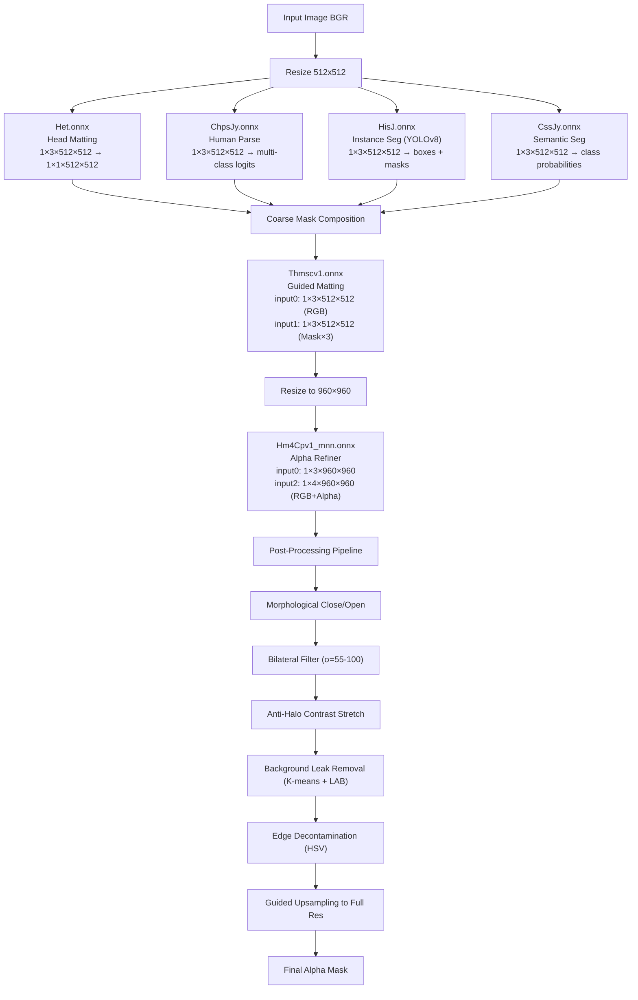
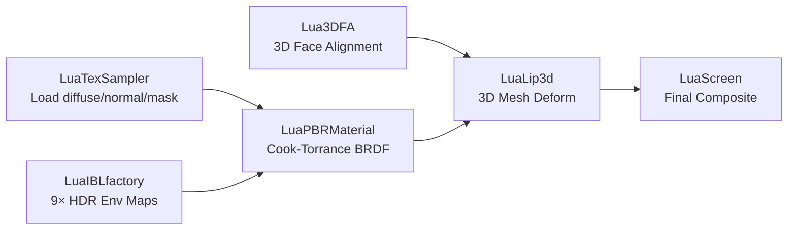

# 🧠 Kumoo Algorithm Bible — Complete Reverse Engineering

> Updated: 2026-08-15

## Overview

Kumoo's processing pipeline has 3 layers:
1. **`mtai::` C++ AI Engine** — 64 modules for detection, segmentation, beautification
2. **`megatron::` Render Engine** — GPU shader pipeline for effects
3. **BluePrint Lua Scripts** — Orchestration layer connecting AI → Rendering

### Mizar-only models đã xuất ONNX độc lập

Nhóm 11 model không có CoreML twin đã được chuyển thành ONNX tự chứa và so khớp số học với Mizar CPU. Ánh xạ chức năng được xác nhận từ tên module/filter trong binary app và I/O graph:

| ONNX | Module/filter gốc | Chức năng |
|---|---|---|
| `20260203_440epoch_sim_remove_expend_modify` | `MTAutoExposure` | Trích đặc trưng cho tự động phơi sáng |
| `365` | `AIBeautyGlassesFilter` | Phân tích/xử lý vùng kính và sinh map cho blend |
| `Expelliarmus` | `GPUImageClothOutlineOffsetFilter` | Trường offset 2D sửa viền quần áo/cơ thể |
| `MTCheek_model` | `MTAIENGINE_MODEL_FACE_CHEEK` | Phân loại đặc trưng má (2 score) |
| `MTJaw_model` | `MTAIENGINE_MODEL_FACE_JAW` | Phân loại đặc trưng hàm (3 score) |
| `PhotoFaceContour` | `MTAIENGINE_MODEL_PHOTOSEG_FACECONTOUR` | Phân đoạn đường bao/vùng mặt |
| `eye_segment` | `MTEyeSegmentModule` | Phân đoạn vùng mắt |
| `hairSeamer_full` | `MTHairSeamerModule` | Tinh biên và phục hồi sợi tóc |
| `haircut_1104_1024_epoch_740_1624_new4` | `GPUImageHairCutFilter` / `MTHairGrouthModule` | Sinh ảnh tóc cho chỉnh hair growth/haircut |
| `restoreteeth` | `MTRestoreTeethModule` | Phân loại, mask và ảnh phục hồi răng |
| `skintone_0411_384_epoch_850_2` | `GPUImageSkinToneBodyAPIFilter` / `MTSkinToneMappingModule` | Chỉnh và đồng đều tông da cơ thể |

I/O đầy đủ, báo cáo parity và các giới hạn diễn giải nằm trong `PROJECT_SUMMARY.md` mục 6.1 và `MIZAR_ONNX_NUMERICAL_PARITY.md`.

### Contract ứng dụng của `skintone_0411`

Parity tensor của graph không đồng nghĩa có thể đưa ảnh gốc vào rồi hiển thị output trực tiếp. Disassembly của `GPUImageSkinToneBodyAPIFilter` cho thấy wrapper gốc thực hiện một giao thức residual theo màu da đại diện `skinRGB`:

```text
encodedRGB = clamp((sourceRGB - skinRGB) * 0.5 + 127.5, 0, 255)
modelRGB   = skintone(encodedRGB / 255)
resultRGB  = clamp((modelRGB * 255 - 126.0) * 2.0 + skinRGB, 0, 255)
```

Pixel ngoài mask được đặt về RGB `(127,127,127)` trước inference. `skinRGB` được lấy từ pixel skin-mask độ tin cậy cao sau khi loại hai đầu histogram độ sáng (30%). Bản thử nghiệm một mặt dùng mask `PhotoFaceContour` cho bước này. Đây là preprocessing/postprocessing của model lõi, không phải bộ lọc làm đẹp phụ.

Các field `skinTone24`, `skinBrightLvl`, `skinHueDelta` tồn tại trong contract C++ bên ngoài graph. Chúng không phải tensor input của ONNX và không được giả thành slider khi chưa phục hồi đầy đủ đường điều khiển tương ứng.

---

## 1. AI Modules (64 total)

### Segmentation & Matting
| Module | Model (.manis) | Function |
|---|---|---|
| `MTSegmentModule` | PhotoHumanMatting, PhotoMattingAlpha, PhotoMattingTrimap | **Core matting** — human/object segmentation |
| `MTSegmentModule` | PhotoHair, PhotoHead, PhotoSkin, PhotoSky | **Part segmentation** — hair/head/skin/sky masks |
| `MTSegmentModule` | PhotoFullBody, PhotoHalfBody, PhotoCloth | **Body/clothing** segmentation |
| `MTSegmentModule` | PhotoDeepBlurArnet, PhotoDeepBlurIunet | **Depth-based blur** (portrait mode) |
| `MTSegmentModule` | PhotoSam, PhotoForeGround | **SAM-based** interactive segmentation |
| `MTSegmentModule` | PhotoMidas, PhotoMonocularDepth, PhotoSpaceDepth | **Depth estimation** |
| `MTInstanceSegmentModule` | InstanceSeg_backone, _mask, _detectionA/B | **Instance segmentation** (multi-person) |
| `MTEyeSegmentModule` | eye_segment, EyeSeg | **Eye region** segmentation |

### Face & Landmark Detection
| Module | Model | Function |
|---|---|---|
| `MTFaceModule` | face_net, FD2 | Face detection (bounding box) |
| `MTLandmarkModule` | model (generic) | 240+ facial landmarks |
| `MT3DFaceModule` | rigging, FFH, FFC | **3D face mesh** reconstruction |
| `MTDL3DModule` | DL3D models | Deep learning 3D face |
| `MTFaceAnalysisXModule` | FAD, FNS | Face analysis (age, gender, expression) |
| `MTFaceHDModule` | FHW, FaceHD | HD face detail enhancement |
| `MTFaceBlitModule` | FaceBlitModel | Face swap/transfer |

### Body & Pose
| Module | Model | Function |
|---|---|---|
| `MTBodyModule` | body_net, realtime_detection A/B | Body detection (YOLOv8) |
| `MTBodyInOneModule` | Various | All-in-one body processing |
| `MTHandModule` | hand_detect, handjoints | Hand detection + finger joints |
| `MTShoulderModule` | shoulder_point_detection | Shoulder point landmarks |

### Skin & Beauty
| Module | Model | Function |
|---|---|---|
| `MTSkinModule` | stain_v1, front_pandaeyes, UserSkinType | Skin analysis (spots, dark circles, type) |
| `MTSkinMicroModule` | pore, poreseg2a, key_fleck_20220616 | **Micro skin** (pore detection) |
| `MTSkinBCCModule` | bcc | Skin blemish correction |
| `MTSkinARModule` | AR skin with 3D mesh vertices | AR skin overlay |
| `MTEveSkinModule` | EveSkin models | Advanced skin processing |
| `MTSkinToneMappingModule` | skintone_0411 | Skin tone correction |
| `MTWrinkleDetectionModule` | MTWrinkleDetection_eye/forehead/naso/neck | Wrinkle detection per region |
| `MTNevusDetectionModule` | acne_v1 | Mole/acne detection |

### Hair Processing  
| Module | Model | Function |
|---|---|---|
| `MTHairModule` | PhotoHair, RealtimeHair | Hair segmentation |
| `MTDenseHairModule` | DenseHair models | Dense hair rendering |
| `MTHairDyeModule` | HairDye models | Hair color change |
| `MTHairCurlyModule` | HairCurly models | Curl hair effect |
| `MTHairFluffyModule` | HairFluffy models | Volume increase |
| `MTHairGrouthModule` | haircut_1104 | Hair growth simulation |
| `MTHairStraightModule` | HairStraight | Hair straightening |
| `MTHairSeamerModule` | HairSeamer | Hair edge seaming |

### Teeth & Smile
| Module | Model | Function |
|---|---|---|
| `MTTeethModule` | n2n_teeth, squeezenet_teeth_classify | Teeth whitening |
| `MTRTTeethRetouchModule` | teeth_2200_0624 | Real-time teeth retouch |
| `MTRestoreTeethModule` | RestoreTeeth | Teeth restoration |
| `MTSmileModule` | Chuckle | Smile enhancement |

### Makeup & Effects
| Module | Model | Function |
|---|---|---|
| `MTMakeupModule` | makeup2.0.0.2_eye/brow/mouth | AI makeup application |
| `MTKiev3DMakeModule` | Kiev3D models | 3D makeup rendering |
| `MTEyelidRealtimeModule` | eyelid_rt_dan/kai/ou/ping | Double eyelid types |
| `MTNoseBlendModule` | blend_nose | Nose reshaping |
| `MTDoubleChinFixModule` | DoubleChinFix | Double chin removal |
| `MTPortraitInpaintingModule` | portrait_inpainting | Face inpainting |
| `MTRemoveWatermarkModule` | remove_watermark | Watermark removal |

### Other
| Module | Model | Function |
|---|---|---|
| `MTFoodModule` | foodet_classify, foodet_detector | Food detection |
| `MTAnimalModule` | AnimalModels | Animal detection |
| `MTImageDetectionModule` | image_detection_human/scene | Scene/human detection |
| `MTImageRecognitionModule` | ImageRecognition | Image classification |
| `MTCgStyleModule` | CgStyle models | Cartoon/CG style transfer |
| `MTCsketchModule` | Csketch models | Sketch generation |
| `MTMaterialTrackingModule` | MaterialTracking | AR material tracking |
| `MTVideoStabilizationModule` | VideoStabilization | Video stabilization |

---

## 2. Core Matting Pipeline (6-Model Cascade)



### Preprocessing (ALL models)
```python
# Standard preprocessing for MNN models
image = cv2.resize(bgr_image, (512, 512))
image = cv2.cvtColor(image, cv2.COLOR_BGR2RGB)
image = image.astype(np.float32) / 255.0
image = np.transpose(image, (2, 0, 1))  # HWC → CHW
image = np.expand_dims(image, 0)         # Add batch dim: 1×3×H×W
```

### Key Post-Processing Algorithms

#### Anti-Halo Alpha Refinement
```python
# Contrast stretching to remove edge halos
alpha = (alpha - 0.35) / 0.3  # Shift + scale
alpha = np.clip(alpha, 0, 1)
alpha = cv2.GaussianBlur(alpha, (3, 3), 0)
```

#### Background Leak Removal (K-Means + LAB)
```python
# 1. Convert to LAB color space
lab = cv2.cvtColor(image, cv2.COLOR_BGR2LAB)
# 2. K-means cluster border pixels to find BG color
# 3. Flood fill from borders 
# 4. Suppress regions matching BG color clusters
# 5. Zero alpha where BG detected
```

#### Edge Decontamination (Color Spill Fix)  
```python
# Closed-form foreground estimation
F = cv2.blur(image * alpha) / cv2.blur(alpha)  
# Erode foreground, dilate to fill spill boundary
# Apply in HSV space for color-aware correction
```

#### Guided Upsampling (HD Output)
```python
# He et al. edge-aware Guided Filter
gray = cv2.cvtColor(full_res, cv2.COLOR_BGR2GRAY)
up = cv2.resize(alpha_small, full_res.shape[:2])
alpha_hd = guided_filter(gray, up, r=60, eps=1e-4)
# Contrast stretch transition band [0.15, 0.85]
```

---

## 3. GPU Shader Pipeline

### Matting Mask Compositor (GLSL)
```glsl
uniform sampler2D edgeMaskTexture;       // From edge detection model
uniform sampler2D mattingMaskTexture;     // From matting model
uniform sampler2D u_texture;             // Original image
uniform vec4 maskEdgeColor;

void main() {
    vec4 edgeMaskColor = texture2D(edgeMaskTexture, v_texcoord);
    vec4 mattingMaskColor = texture2D(mattingMaskTexture, v_texcoord);
    
    // Take the MAXIMUM of edge mask and matting mask
    if (edgeMaskColor.r > mattingMaskColor.r) {
        gl_FragColor = vec4(edgeMaskColor.r);
    } else {
        gl_FragColor = vec4(mattingMaskColor.r);
    }
}
```

### Sharpening Algorithm (GLSL)
```glsl
float sharpenLumOrig = color.r * 0.3333 + color.g * 0.5 + color.b * 0.1667;
float sharpenDLum = (sharpenLumOrig * 1.4 - lsc_lum * 1.484 + 0.042) - 0.5;
color = clamp(color + sharpenDLum * sharpenStrength, 0.0, 1.0);

// Structure-aware sharpening
float structureLookupLum = clamp(sharpenLumOrig + clamp(-sharpenDLum, ...));
float lum_new1 = sharpenLumOrig + structureStrength * ...;
gl_FragColor.rgb = lum_new1 + (color - sharpenLumOrig) * saerf + 0.5;
```

### Liquify/Warp Engine (GLSL)
```glsl
uniform int liquifyNum;
uniform vec4 coeffSrc[MAX_LIQUIFY];   // center, radius, movement
uniform vec4 coeffUser[MAX_LIQUIFY];  // control points
uniform float coeffStyle[MAX_LIQUIFY]; // blend weights

for (int i = 0; i < liquifyNum; ++i) {
    // Forward warping with radial falloff
    // Applied to face slim, eye enlarge, nose reshape, chin adjust
}
```

### Background Replace
```glsl
// Color gradient background
vec4 color_bg = u_color_mesh1 * coord_t + u_color_mesh2 * (1.0 - coord_t);
// Composite: fg * alpha + bg * (1 - alpha)
```

---

## 4. Lua Blueprint Pipeline (Makeup Rendering)

### Module Architecture
```
BluePrint/
├── main.lua              — Entry point, pipeline orchestration
├── ui.lua                — Parameter UI definitions
├── BluePrint.json         — Node graph connections
├── ModulesList.json       — Available modules
└── modules/
    ├── LocateMethod/Lua3DFA/    — 3D Face Alignment
    ├── MakeUp3D/LuaLip3d/       — 3D Lip Rendering  
    ├── Material/LuaPBRMaterial/  — PBR Material System
    ├── IBL/LuaIBLfactory/       — Image-Based Lighting
    ├── Basical/LuaTexSampler/   — Texture Sampling
    └── Output/LuaScreen/        — Final Compositing
```

### 3D Lip Rendering Pipeline (PBR)

> [!IMPORTANT]
> Lua scripts are **compiled to bytecode** — algorithm extracted from JSON node graphs + shader params.



**Cook-Torrance BRDF Parameters:**
```json
{
    "Roughness": 0.23,
    "Metallic": 1.0,
    "Reflectance": 0.5,
    "ClearCoatStrong": 0.8,
    "RefractStrong": 0.3,
    "BSDFRefract": 0.1,
    "DispersionStrong": 0.05,
    "FabricF0": 0.04,
    "FabricF90": 1.0,
    "IBLdiffuseStrong": 0.6
}
```

**LuaLip3d Parameters:**
- `mouth.obj` — 3D mesh deformed by 3DFA landmarks
- `BlendType`: add | screen | default
- `ShadingType`: Exponent | Linear | default  
- `RotateStrengthX/Y/Z` — tracking multipliers
- `Opacity` — final blend alpha
- `MaskFile` — 2D alpha mask (`lipmask2d.png`)

**Lua3DFA (Face Alignment):**
- `maxSupportFace`: max faces to track
- `GenderFilter`: BOTH | LADY_ONLY | BOY_ONLY
- Output: `LocateMethod` (pose + mesh) → passed to all 3D nodes

### 2D Makeup (Legacy Plist Format)

**Natural (ziran):**
```xml
<dict>
    <key>FacePart</key>
    <dict>
        <key>LocateMethod</key><string>landmark</string>
        <key>FilterType</key><string>overlay</string>
        <key>ORGBA</key><array><!-- opacity, R, G, B, A --></array>
        <key>Operation</key><string>blend</string>
        <!-- Textures: al.png, ar.png, ll.png, lr.png per face region -->
    </dict>
</dict>
```

**Rose (meigui) — Lipstick Engine:**
```xml
<dict>
    <key>FacePart</key>
    <dict>
        <key>type</key><string>MPLIPSTICK</string>
        <key>ORGBA</key><array><!-- base lip color --></array>
        <key>LipstickMode</key><integer>1</integer>
        <key>GlossAlpha</key><real>0.6</real><!-- specular -->
        <key>LightAlpha</key><real>0.4</real>
        <key>WhitenDegree</key><real>0.3</real><!-- teeth whitening -->
    </dict>
</dict>
```

---

## 5. Model ↔ Decrypted File Mapping

| .manis Name | Decrypted ONNX | Function |
|---|---|---|
| PhotoHumanMatting | Hm4Cpv1_mnn.onnx | Alpha refiner (960×960) |
| PhtoHumanSeg | Thmscv1.onnx | Guided matting |
| PhotoHead | Het.onnx | Head/hair mask |
| PhotoHair | F2sch1b.onnx | Hair segmentation |
| PhotoSkin | Cis.onnx | Skin segmentation |
| PhotoSky | (sky model) | Sky segmentation |
| face_net | Fd.onnx | Face detection |
| model (landmark) | Lp.onnx | 240+ landmarks |
| body_net | Bp.onnx | Body detection |
| rigging | Tcv5s.onnx | 3D face mesh (13 sub-models) |

---

## 6. Key Parameters (from Kumoo binary)

```json
{
    "segment_mode": "photo|realtime|video",
    "binaryThreshold_": 0.5,
    "enableFaceCrop_": true,
    "head_segment_use_facemask_": true,
    "refineForehead": true,
    "refineNeck": true,
    "background_detain_alpha": 0.0,
    "contour_smooth_alpha": 0.5,
    "sharpenStrength": 0.3,
    "structureStrength": 0.2,
    "liquifyNum": "up to MAX_LIQUIFY"
}
```

---

## 7. Known Issues / Gaps

| Issue | Impact |
|---|---|
| `F2sch1b.onnx` (hair) fails MNN shape inference | Hair matting disabled |
| `CssJy` detects curtains as human | Heavy K-means workaround needed |
| CPU inference (6 models sequential) | **~8-15 sec** vs native GPU **~0.5 sec** |
| `foregroundEstimator.glsl` not fully extracted | Edge color correction approximate |
| Native `ARKernel` liquify not accessible | Face warp approximate only |
| `online_model_20260524.lib` models not dumped | Latest cloud models missing |
