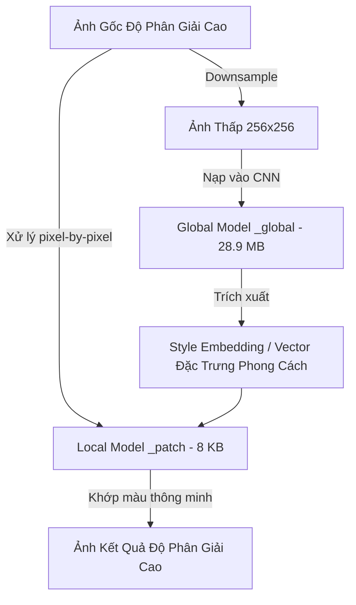

# Phân Tích Thuật Toán & Mô Hình Truyền Màu Thông Minh (AI Color Transfer) Của Meitu

Tính năng truyền màu thông minh (AI Color Transfer / Color Migration) của Meitu (Cubeo/Wink) giúp đồng nhất tone màu của ảnh theo các phong cách định sẵn mà không làm biến dạng hay gai màu da người. Thuật toán này được đặt tên là **StyleNormV9** (Style Normalization Version 9).

Dưới đây là phân tích chi tiết về kiến trúc hai mô hình kết hợp, phân loại cảnh quan, danh sách các preset màu trích xuất trực tiếp từ database và quy trình suy luận tối ưu.

---

## 1. Danh Sách Các Mô Hình StyleNormV9 Đã Trích Xuất

Trong thư mục mô hình đã giải mã, các tệp liên quan đến tính năng truyền màu được phân loại theo từng ngữ cảnh môi trường (Scene Context):

| Tên Mô Hình | File Giải Mã | Kích Thước | Ngữ Cảnh Áp Dụng |
| :--- | :--- | :--- | :--- |
| `stylenormV9-neijing_global` | `Tlgv9-N01a.onnx` | **28.89 MB** | **Nội cảnh (Indoor / Studio):** Tông màu ấm, ánh sáng nhân tạo. |
| `stylenormV9-neijing_patch` | `Tlgv9-N01b.onnx` | **8.18 KB** | Xử lý chi tiết cục bộ cho nội cảnh. |
| `stylenormV9-lvzhi_global` | `Tlgv9-N02a.onnx` | **28.89 MB** | **Cây cối (Greenery / Nature):** Tông màu xanh lá, ngoại cảnh tự nhiên. |
| `stylenormV9-lvzhi_patch` | `Tlgv9-N02b.onnx` | **8.18 KB** | Xử lý chi tiết cục bộ cho ảnh nhiều cây cối. |
| `stylenormV9-shijing_global` | `Tlgv9-N03a.onnx` | **28.89 MB** | **Ngoại cảnh đô thị (Street Scene):** Tông màu đường phố, kiến trúc. |
| `stylenormV9-shijing_patch` | `Tlgv9-N03b.onnx` | **8.18 KB** | Xử lý chi tiết cục bộ cho ảnh đường phố. |
| `stylenormV9-sea_global` | `Tlgv9-N04a.onnx` | **28.89 MB** | **Biển cả (Seascape / Ocean):** Tông màu xanh dương, bãi biển. |
| `stylenormV9-sea_patch` | `Tlgv9-N04b.onnx` | **8.18 KB** | Xử lý chi tiết cục bộ cho ảnh biển. |

---

## 2. Danh Sách Bản Đồ Khóa Giải Mã Các Preset Màu StyleNormV9 Thực Tế

Dữ liệu dưới đây được trích xuất trực tiếp từ bảng `modelFile` của SQLite `base.db`, chứa đường dẫn CDN tải xuống và khóa giải mã đối xứng AES-256 của từng preset màu StyleNormV9:

### A. Preset: Văn Nghệ Thanh Xuân - Thấp Bão Hòa (文艺清新-低饱和)
*   **PID:** `stylenormV9-lvzhi` (Thích hợp cho ngoại cảnh cây cối)
*   **Các tệp tin mô hình:**
    1.  *Mô hình Global:* `liYDoGzSWC72O4FzadXTge1eXsCR`
        *   Khóa giải mã AES: `9U7DXPjSBAmhvyUPn-A2fiUmQFpaQS-HpENFBgRJ2Cc=`
        *   URL: `https://qnm.hunliji.com/liYDoGzSWC72O4FzadXTge1eXsCR`
    2.  *Mô hình Patch:* `FjJHwRSmm_z45kOgvpqMBXMhVJlu`
        *   Khóa giải mã AES: `p-CiVf6toRYHvI1PaEX5X2jqOggNO9e62w3dPgMDN0E=`
        *   URL: `https://qnm.hunliji.com/FjJHwRSmm_z45kOgvpqMBXMhVJlu`

### B. Preset: Đen Trắng Xám - Thông Dụng (黑白灰 - 通用)
*   **PID:** `stylenormV9-neijing` (Thích hợp cho nội cảnh)
*   **Các tệp tin mô hình:**
    1.  *Mô hình Global:* `lpXU0ZoLfs7CKyYMKZRBLZnz_tar`
        *   Khóa giải mã AES: `4n74rCclOsgPYX6liZSktfRr_sx_KTOOfZrDBM3iKEM=`
        *   URL: `https://qnm.hunliji.com/lpXU0ZoLfs7CKyYMKZRBLZnz_tar`
    2.  *Mô hình Patch:* `FgyDwDJ038cnz-Rtx6D0ghTsAw_X`
        *   Khóa giải mã AES: `k0gKqJ2UupehuiVetyLuNNh313v6Klt4YuUxkxyT0mM=`
        *   URL: `https://qnm.hunliji.com/FgyDwDJ038cnz-Rtx6D0ghTsAw_X`

### C. Preset: Nền Đen - Nhu Hòa (黑背景 - 柔和)
*   **PID:** `stylenormV9-neijing`
*   **Các tệp tin mô hình:**
    1.  *Mô hình Global:* `lqMagMAHn3qfMpjEJX3XiBcuDfSs`
        *   Khóa giải mã AES: `nR235wbO8aPaJnGf-6FK_Tj3EBEl2YGL6LrtmPvbeHM=`
        *   URL: `https://qnm.hunliji.com/lqMagMAHn3qfMpjEJX3XiBcuDfSs`
    2.  *Mô hình Patch:* `FmSL09xBscoBbCMG-E1gG2CBj0wv`
        *   Khóa giải mã AES: `9P_iIC3zxta87hCn1C35wzPNYWrJjwdgmkeDqmY6h-I=`
        *   URL: `https://qnm.hunliji.com/FmSL09xBscoBbCMG-E1gG2CBj0wv`

### D. Preset: Hiệu Chỉnh Màu Thông Minh - Thông Dụng (智能校色 - 通用)
*   **PID:** `stylenormV9-pure`
*   **Các tệp tin mô hình:**
    1.  *Mô hình Global:* `ltVPlTxatejgos2qpff162O_IVMt`
        *   Khóa giải mã AES: `KYmFiAmZUs422SFUnPm-ycC6kTWVi70_YcqjiaeVSTk=`
        *   URL: `https://qnm.hunliji.com/ltVPlTxatejgos2qpff162O_IVMt`
    2.  *Mô hình Patch:* `FiF_auym6li_PVaamKF_UY4pVMr1`
        *   Khóa giải mã AES: `gb5tbjB9QOYEGhqSdfSxq_mYqgBHmMbyclKKPj-m51M=`
        *   URL: `https://qnm.hunliji.com/FiF_auym6li_PVaamKF_UY4pVMr1`

### E. Preset: Chân Dung Tự Nhiên (自然人像)
*   **PID:** `stylenormV9-pure`
*   **Các tệp tin mô hình:**
    1.  *Mô hình Global:* `lpTcAXczoW9f49-ey3xh6yenwfPX`
        *   Khóa giải mã AES: `gRr8CY8ZoMZryam29fo45RkfSp7vGmIvnX0yB0naroA=`
        *   URL: `https://qnm.hunliji.com/lpTcAXczoW9f49-ey3xh6yenwfPX`
    2.  *Mô hình Patch:* `FrFiMG3F1iQQcXvljG80sGhBCGRV`
        *   Khóa giải mã AES: `MN7WXF4EoLze4cyYe2ARl3gTA2QVi-V7u6FpnwJKZW4=`
        *   URL: `https://qnm.hunliji.com/FrFiMG3F1iQQcXvljG80sGhBCGRV`

---

## 3. Kiến Trúc Hai Mô Hình Kết Hợp (Dual-Model Architecture)

Meitu giải quyết bài toán truyền màu bằng cách chia nhỏ tác vụ cho **hai mô hình** chạy song song: một mô hình CNN lớn xử lý ngữ cảnh toàn cục, và một mô hình MLP siêu nhẹ xử lý cục bộ điểm ảnh.

### A. Mô Hình Toàn Cục (`_global` - Kích thước ~28.9 MB)
*   **Kiến trúc:** Là một mạng tích chập sâu (Deep CNN) nặng.
*   **Nhiệm vụ:** Phân tích ngữ cảnh ngữ nghĩa (Semantic Context) của bức ảnh ở độ phân giải thấp (thường là `256x256`). Mạng này học cách nhận diện đâu là da người, bầu trời, nước biển hay cây cối.
*   **Đầu ra:** Xuất ra một **Style Embedding Vector** (Vector biểu diễn phong cách màu) hoặc các tham số của một **3D LUT động** (Dynamic 3D Look-Up Table).

### B. Mô Hình Cục Bộ (`_patch` - Kích thước siêu nhẹ ~8 KB)
*   **Kiến trúc:** Là một mạng perceptron đa tầng cực nhỏ (Tiny MLP) hoặc bộ lọc ma trận affine màu.
*   **Nhiệm vụ:** Nhận đầu vào là các pixel màu gốc độ phân giải cao kết hợp với Style Embedding Vector từ mô hình `_global`. Nó sẽ tính toán màu sắc dịch chuyển cục bộ cho từng điểm ảnh.
*   **Lý do có kích thước 8 KB:** Việc chạy một mạng CNN 28.9 MB trực tiếp trên ảnh gốc 4K hoặc ảnh dung lượng lớn sẽ làm sập RAM và đơ ứng dụng. Bằng cách tách biệt, mô hình `_patch` 8 KB có thể chạy cực nhanh trên từng pixel của ảnh gốc độ phân giải cao mà không tốn tài nguyên.

---

## 4. Quy Trình Xử Lý Chi Tiết Của Thuật Toán

Quy trình truyền màu thông minh được thực thi qua các bước sau:

1.  **Phân loại môi trường:** Phần mềm phân tích bức ảnh đầu vào thuộc nhóm cảnh nào (Nội thất, Cây cối, Phố thị hay Bãi biển) để tự động chọn cặp mô hình tương ứng (ví dụ: ảnh bãi biển chọn `Tlgv9-N04a` và `Tlgv9-N04b`).
2.  **Trích xuất đặc trưng màu:** Ảnh được đưa qua mô hình `_global` để tính toán bản đồ phân bổ màu sắc tối ưu sao cho khớp với ảnh phong cách đích.
3.  **Khớp màu chọn lọc (Selective Color Matching):**
    *   **Bảo vệ tone da người (Skin-tone Protection):** Nhờ phân tích ngữ nghĩa của mô hình `_global`, mô hình `_patch` biết khu vực nào là da người để giảm cường độ dịch chuyển màu, giữ cho da người luôn hồng hảo, ấm áp, tránh bị xanh xao hoặc ám màu của phông nền.
    *   **Áp dụng màu phông nền:** Tập trung dịch chuyển màu mạnh ở các vùng như lá cây (làm xanh mướt hoặc vàng úa theo phong cách), bầu trời (đưa về tone xanh dương hoặc hoàng hôn), nước biển.
4.  **Nội suy màu sắc:** Bản đồ màu sau cùng được nội suy ngược lại ảnh gốc kích thước đầy đủ (Full resolution) để xuất ra sản phẩm sắc nét nhất mà không có nhiễu hạt hay gai màu.
