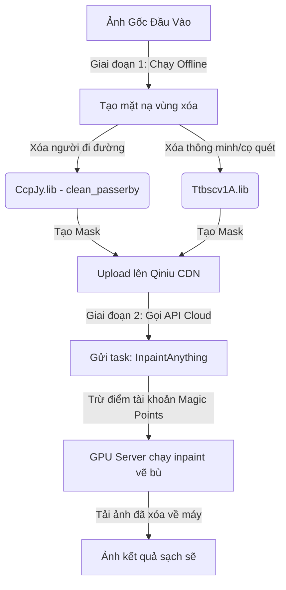

# Phân Tích Kỹ Thuật Nhóm Công Cụ Sáng Tạo (AI Creative Tools) Của Cubeo

Nhóm công cụ sáng tạo trong Cubeo (gồm **Xóa người đi đường - RemovePerson** và **Xóa thông minh vật thể - SmartRemoval**) hoạt động theo cơ chế **Hybrid (Lai ghép)**: tự động nhận diện và sinh mặt nạ (Mask) cục bộ, sau đó gửi ảnh và mặt nạ lên đám mây để vẽ bù (Inpainting).

Dưới đây là tài liệu phân tích kỹ thuật chi tiết về cơ chế hoạt động, các mô hình AI liên quan, mã nguồn JS và giải pháp chạy offline 100%.

---

## 1. Cơ Chế Hoạt Động Lai Ghép (Hybrid Pipeline)

Để tối ưu hóa hiệu năng và trải nghiệm người dùng, hệ thống chia tác vụ làm 2 giai đoạn:



### 1.1. Giai đoạn 1: Tạo mặt nạ vùng chọn (Chạy Offline cục bộ)
Hệ thống sử dụng các mô hình AI cục bộ để nhận diện biên vật thể hoặc người đi đường:
*   **Xóa người thừa (RemovePerson):** Lõi C++ gọi mô hình **`CcpJy.lib`** (`clean_passerby` / `CcpJy.onnx` ~41.9 MB) thông qua hàm `getCleanPassbyMask(config)` để tự động phát hiện người đi đường và vẽ sẵn vùng chọn (Mask).
    *   *Khóa AES-256-CTR:* `xdBrAlnOPSSxjjQt3u_pJ9UBLh9cwqR3hFlC31w9EcS=`
*   **Xóa thông minh (SmartRemoval):** Khi người dùng quét cọ vẽ lên vật thể bất kỳ, mô hình **`Ttbscv1A.lib`** / `Ttbscv1A.onnx` (~8.9 MB) tự động hiệu chỉnh biên cọ vẽ bám sát vào viền của vật thể để tạo ra một mặt nạ chính xác nhất.
    *   *Khóa AES-256-CTR:* `HxejoTPF0G01cqLjyrPv3mYaimSBclhhNvGckiPXBdp=`

### 1.2. Giai đoạn 2: Vẽ bù lấp đầy phông nền (Chạy Online trên Cloud)
Mã nguồn React UI chuyển đổi nét vẽ cọ thành một ảnh đen trắng (Mask Image) rồi thực hiện tải lên máy chủ đám mây:
1.  **Tải ảnh lên CDN Qiniu (七牛云):** Gọi API lấy token (`/uptoken`) và tải cả ảnh gốc và ảnh mặt nạ lên CDN.
2.  **Gửi tác vụ vẽ bù (Inpainting):** Gửi yêu cầu HTTP POST đến API Cloud:
    *   *Endpoint:* `/hms/selectPhoto/appApi/creative/creativePhoto/submit`
    *   *Payload:* Gửi kèm liên kết ảnh gốc (`imgUrl`), ảnh mặt nạ (`maskUrl`) và chỉ định loại thuật toán xử lý là **`InpaintAnything`**.
3.  **Hệ thống trừ điểm (Magic Points):** Mỗi lần chạy tác vụ này, hệ thống sẽ trừ trực tuyến điểm tài khoản của bạn (kiểm tra qua API `/appApi/creative/account/accountAmount`).
4.  **Nhận kết quả:** React UI thực hiện Polling (truy vấn lặp lại) tới API `/creativePhoto/recordQry` cho đến khi trạng thái báo thành công để lấy liên kết ảnh sạch đã xóa vật thể tải về máy.

---

## 2. Trích Xuất Giao Diện JavaScript (`module_24011.js` & `157.js`)

### A. Code JS Tạo Ảnh Mặt Nạ Đen Trắng (`module_24011.js`)
Mã nguồn React UI duyệt qua dữ liệu điểm ảnh (pixels) của Canvas cọ vẽ, chuyển các vùng trống thành màu đen và các nét cọ vẽ thành màu trắng hoàn toàn:

```javascript
// Trích xuất từ module_24011.js dòng 48900
for (s = 0; s < l.length; s += 4) {
    if (0 === l[s + 3]) {
        // Vùng không vẽ cọ -> chuyển thành màu ĐEN
        l[s] = 0;
        l[s + 1] = 0;
        l[s + 2] = 0;
        l[s + 3] = 255;
    } else {
        // Nét vẽ cọ -> chuyển thành màu TRẮNG
        l[s] = 255;
        l[s + 1] = 255;
        l[s + 2] = 255;
        l[s + 3] = 255;
    }
}
```

### B. Code JS Gọi Tác Vụ Gửi Lên Server Cloud (`157.js`)
Gửi gói tin JSON yêu cầu chạy dịch vụ xử lý ảnh lên API máy chủ:

```javascript
// Trích xuất cấu trúc payload gọi lên endpoint /creativePhoto/submit
var payload = {
    id: "photo_id_he_thong",
    funcType: "InpaintAnything", // Thuật toán vẽ bù đám mây
    funcParams: {
        imgUrl: "https://qnm.hunliji.com/original_image.jpg", // Link ảnh gốc đã up lên CDN
        maskUrl: "https://qnm.hunliji.com/mask_image.png"    // Link ảnh mặt nạ đen trắng
    },
    taskType: 1 // 1: Xóa người đi đường (RemovePerson), 2: Xóa thông minh (SmartRemoval)
};
```

---

## 3. Giải Pháp Thay Thế Để Chạy Offline 100% (Standard Offline Replacement)

Để bẻ khóa (bypass) việc phụ thuộc vào đám mây và hệ thống trừ điểm trực tuyến, bạn có thể triển khai giải pháp thay thế chạy offline hoàn toàn thông qua mô hình **LaMa (Large Mask Inpainting)** kết hợp với công cụ mã nguồn mở **IOPaint**:

### 3.1. Tại sao lựa chọn LaMa làm mô hình thay thế tiêu chuẩn?
*   **Trọng lượng nhẹ:** Mô hình LaMa chỉ nặng khoảng **300 MB** (dễ dàng tích hợp vào bộ cài đặt offline).
*   **Hiệu năng vượt trội:** Chạy trên CPU mất 0.5s đến 1s, chạy bằng GPU (CUDA) chỉ mất từ **30 - 50ms** cho mỗi lần inpaint.
*   **Chất lượng phục hồi cao:** Sử dụng mạng tích chập Fourier nhanh (FFC) giúp sửa biên các đường thẳng, vân gỗ, lan can rất thẳng và sắc nét, không bị méo mó như các mô hình CNN thông thường.

### 3.2. Hướng dẫn thiết lập Server Inpaint Local:
1.  **Cài đặt thư viện xử lý:**
    ```bash
    pip install iopaint
    ```
2.  **Khởi động Server cục bộ (tự động tải mô hình LaMa chạy offline):**
    ```bash
    iopaint start --model=lama --host=127.0.0.1 --port=8080
    ```
3.  **Chuyển hướng API trong mã nguồn:**
    Sửa đổi code gọi API trong tệp `module_24011.js`. Thay thế việc gửi POST lên máy chủ Hunliji bằng việc gửi trực tiếp ảnh gốc và ảnh mặt nạ dạng FormData về địa chỉ cục bộ:
    `http://127.0.0.1:8080/inpaint`
    Ảnh sau khi xóa vật thể sẽ được server local trả về ngay lập tức hoàn toàn miễn phí và không cần kết nối mạng.
