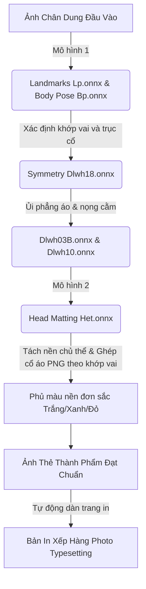

# Phân Tích Kỹ Thuật Tính Năng Tạo Ảnh Thẻ Thông Minh (AI ID Photo Tools) Của Cubeo

Tính năng tối ưu ảnh thẻ (AI ID Photo Tools) của Cubeo (MagiMir) tự động chuyển đổi các bức ảnh chụp thông thường thành ảnh thẻ chuẩn quốc tế (1 inch, 2 inch, hộ chiếu/passport) hoàn toàn offline. Hệ thống thực hiện việc này bằng cách cân chỉnh đối xứng cơ thể, ghép trang phục chuyên nghiệp, đổi màu nền và tự động xếp bố cục tờ in.

Dưới đây là tài liệu phân tích kỹ thuật chi tiết về cấu trúc mô hình, mã nguồn JS truyền cấu hình, giải pháp lập trình cân bằng vai đối xứng và bố cục xếp hàng in ảnh thẻ.

---

## 1. Chuỗi Mô Hình AI Chạy Cục Bộ (ID Photo Pipeline)

Quy trình tạo ảnh thẻ là sự kết hợp khép kín của 4 mô hình học sâu cục bộ:



### Chi tiết vai trò từng mô hình:
1.  **Định vị xương khớp người (`Bp.onnx` - Body Pose ~15 MB):**
    *   *Nhiệm vụ:* Phát hiện các khớp vai (trái/phải), xương đòn và trục cổ. Đây là mốc neo để căn chỉnh độ nghiêng đầu và độ lệch vai.
2.  **Cân đối đối xứng cơ thể (`Dlwh18.onnx` - `idPhotoSymBody` ~8.9 MB):**
    *   *Khóa AES-256-CTR:* `t-yKj4CfyN_uCfrMAZ6LAUPcDkl3f6urW8mrUyrP38g=`
    *   *Nhiệm vụ:* Nhận diện độ lệch giữa vai trái và vai phải thông qua tọa độ của `Bp.onnx`, sau đó tạo ma trận biến dạng lưới (Warping Grid) để kéo chỉnh hai bên vai cân bằng đối xứng qua trục xương cổ.
3.  **Tách nền ảnh thẻ (`Het.onnx` - `head_matting` ~35.7 MB):**
    *   *Khóa AES-256-CTR:* `8aHg8wNknc5FjbcPY30MSUPcFkl3s2FcW6mrUyf4ARU=`
    *   *Nhiệm vụ:* Phân tách phần đầu, tóc và vai ra khỏi nền cũ để đè lên nền đơn sắc mới.
4.  **Làm phẳng trang phục (`Dlwh03B.onnx` - `clotheFlatten` ~15.3 MB):**
    *   *Nhiệm vụ:* Ủi phẳng các vết nhăn trên áo sơ mi/áo vest cũ hoặc sau khi ghép áo mới.

---

## 2. Cấu Trúc Tham Số Mã Nguồn JavaScript (`157.js`)

Khi người dùng bật tính năng ảnh thẻ, React UI gửi đối tượng cấu hình **`certificationPhoto`** xuống tiến trình Magpie:

```javascript
certificationPhoto = {
  photoSize: "passport",         // Kích thước: "1inch", "2inch", "passport" (hộ chiếu)
  backgroundMaterial: "Blue",     // Màu nền: "White", "Blue", "Red" hoặc mã màu Hex
  backgroundCustom: "",          // Đường dẫn ảnh nền tùy chọn tự tải lên
  clothMaterial: "suit_id_001",  // ID trang phục ghép (ví dụ: áo vest nam, sơ mi nữ)
  faceSymmetry: 80,              // Cường độ chỉnh đối xứng khuôn mặt (0 - 100)
  upperBodySymmetry: 90,         // Cường độ chỉnh đối xứng vai (0 - 100, gọi model Dlwh18.onnx)
  layoutSize: "4R"               // Khổ giấy in xuất ảnh: "4R" (10x15cm), "A4", v.v.
}
```

---

## 3. Cơ Chế Ghép Trang Phục Tự Động (AI Clothing Swap)
Khi người dùng chọn một mẫu áo vest (`clothMaterial`), phần mềm thực hiện ghép nối tự động:
1.  **Phát hiện vùng co/vai:** Hệ thống gọi mô hình **`ChpsJy.onnx`** (`human_parse`) để cô lập chính xác tọa độ vùng cổ áo cũ và đường bờ vai của nhân vật.
2.  **Khớp Template:** Lấy tệp PNG cổ áo mẫu có sẵn kênh Alpha trong suốt. Tính toán độ nghiêng vai ($\theta = \arctan(\frac{\Delta Y}{\Delta X})$) và khoảng cách rộng vai từ `Bp.onnx` để **Xoay (Rotate) và Co giãn (Scale)** cổ áo mẫu khớp hoàn toàn vào bả vai.
3.  **Làm phẳng mép:** Áp dụng mô hình **`Dlwh03B.onnx`** (`clotheFlatten`) để tự động ủi phẳng các vệt gấp khúc, nếp nhăn nhúm xuất hiện ở vùng tiếp giáp mép ghép của cổ áo mới.

---

## 4. Bố Cục Xếp Hàng In Ảnh Thẻ (Photo Typesetting)
Đây là tính năng hỗ trợ in ấn chuyên nghiệp, tự động nhân bản và dàn trang nhiều ảnh thẻ kích cỡ khác nhau lên một khổ giấy ảnh lớn (ví dụ: xếp 4 ảnh $3\times4$ và 2 ảnh $4\times6$ lên một tờ giấy in ảnh khổ 4R kích thước $10\times15$ cm):
*   **Tham số kiểm soát:** `layoutSize` (quy định khổ giấy in, mặc định `J8.lP`) và `typesettingPhoto`.
*   **Tự động Crop mặt (`cutCoord`):** Hệ thống dựa trên tọa độ đỉnh đầu và cằm từ `Het.onnx` để xác định khung vùng khuôn mặt theo tỷ lệ chuẩn quốc tế (ví dụ: khuôn mặt chiếm $70\% - 80\%$ diện tích ảnh thẻ), tự động crop ảnh trước khi xếp hàng dàn trang.

---

## 5. Mã Nguồn Giả Lập Thuật Toán Cân Đối Vai Đối Xứng (Python & OpenCV)

Đoạn mã dưới đây mô phỏng giải thuật C++ của model `Dlwh18.onnx`: nhận diện tọa độ 2 khớp vai, tính toán trục chính tâm (trục cổ) và thực hiện phép biến đổi Affine cục bộ để đưa hai khớp vai về vị trí đối xứng cân bằng:

```python
import cv2
import numpy as np

def symmetrize_shoulders(image_path, output_path, left_shoulder_pt, right_shoulder_pt, neck_pt):
    """
    Giả lập cân đối vai đối xứng qua phép biến đổi Affine cục bộ (Warp Affine)
    :param left_shoulder_pt: Tọa độ khớp vai trái (x, y)
    :param right_shoulder_pt: Tọa độ khớp vai phải (x, y)
    :param neck_pt: Tọa độ cổ trung tâm (x, y) làm trục đối xứng
    """
    img = cv2.imread(image_path)
    h, w, c = img.shape

    # 1. Tính toán trục đối xứng trung tâm (Trục cổ dọc)
    center_x = neck_pt[0]

    # 2. Xác định tọa độ mục tiêu đối xứng (Target Points) cho hai vai
    # Khoảng cách trung bình từ vai tới trục cổ
    dist_l = center_x - left_shoulder_pt[0]
    dist_r = right_shoulder_pt[0] - center_x
    mean_dist = (dist_l + dist_r) / 2.0

    # Chiều cao trung bình của hai vai (đưa về cùng một mặt phẳng ngang)
    mean_y = (left_shoulder_pt[1] + right_shoulder_pt[1]) / 2.0

    # Điểm vai mục tiêu sau khi đối xứng hóa
    target_left = (int(center_x - mean_dist), int(mean_y))
    target_right = (int(center_x + mean_dist), int(mean_y))

    print(f"[*] Vai trái gốc: {left_shoulder_pt} -> Mục tiêu: {target_left}")
    print(f"[*] Vai phải gốc: {right_shoulder_pt} -> Mục tiêu: {target_right}")

    # 3. Tạo phép biến đổi Affine cục bộ cho vùng vai trái và vai phải độc lập
    # Chúng ta lấy 3 điểm mốc kiểm soát: Khớp cổ, Khớp vai gốc, và điểm hông biên ảnh
    # Vùng vai trái
    src_pts_l = np.float32([neck_pt, left_shoulder_pt, (0, h)])
    dst_pts_l = np.float32([neck_pt, target_left, (0, h)])
    M_left = cv2.getAffineTransform(src_pts_l, dst_pts_l)

    # Vùng vai phải
    src_pts_r = np.float32([neck_pt, right_shoulder_pt, (w, h)])
    dst_pts_r = np.float32([neck_pt, target_right, (w, h)])
    M_right = cv2.getAffineTransform(src_pts_r, dst_pts_r)

    # 4. Tạo mặt nạ phân vùng (Mask) để chỉ biến dạng vùng vai bên dưới cổ
    mask_left = np.zeros((h, w), dtype=np.uint8)
    cv2.fillPoly(mask_left, [np.array([neck_pt, left_shoulder_pt, (0, left_shoulder_pt[1] + 100), (0, h), (center_x, h)])], 255)
    
    mask_right = np.zeros((h, w), dtype=np.uint8)
    cv2.fillPoly(mask_right, [np.array([neck_pt, right_shoulder_pt, (w, right_shoulder_pt[1] + 100), (w, h), (center_x, h)])], 255)

    # 5. Thực hiện Warp Affine riêng lẻ cho hai nửa vai
    warped_left = cv2.warpAffine(img, M_left, (w, h), borderMode=cv2.BORDER_REFLECT)
    warped_right = cv2.warpAffine(img, M_right, (w, h), borderMode=cv2.BORDER_REFLECT)

    # 6. Trộn hai nửa ảnh đã biến dạng vào ảnh gốc bằng mặt nạ
    img_symmetrized = img.copy()
    
    # Áp vai trái
    mask_l_3ch = cv2.merge([mask_left, mask_left, mask_left]) / 255.0
    img_symmetrized = (mask_l_3ch * warped_left + (1.0 - mask_l_3ch) * img_symmetrized).astype(np.uint8)
    
    # Áp vai phải
    mask_r_3ch = cv2.merge([mask_right, mask_right, mask_right]) / 255.0
    img_symmetrized = (mask_r_3ch * warped_right + (1.0 - mask_r_3ch) * img_symmetrized).astype(np.uint8)

    # 7. Ghi kết quả
    cv2.imwrite(output_path, img_symmetrized)
    print(f"[+] Đã cân chỉnh vai đối xứng thành công! Lưu tại: {output_path}")

# Giả lập với các khớp vai trích xuất được từ Bp.onnx (ví dụ giả định)
if __name__ == "__main__":
    src_img = r"C:\Users\nltruong\input_face.jpg"
    out_img = r"C:\Users\nltruong\scratch\id_photo_symmetry_result.jpg"
    # Giả định tọa độ khớp vai trái, vai phải và cổ của ảnh input_face.jpg
    symmetrize_shoulders(src_img, out_img, left_shoulder_pt=(350, 600), right_shoulder_pt=(670, 630), neck_pt=(500, 520))
```
