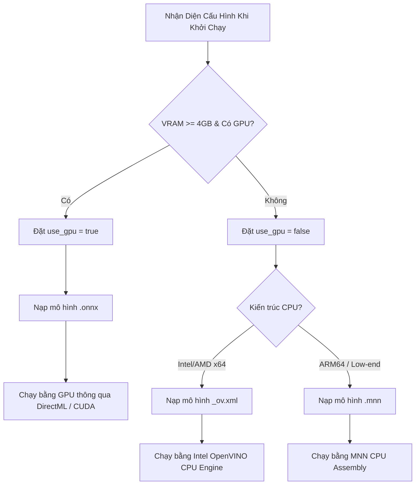
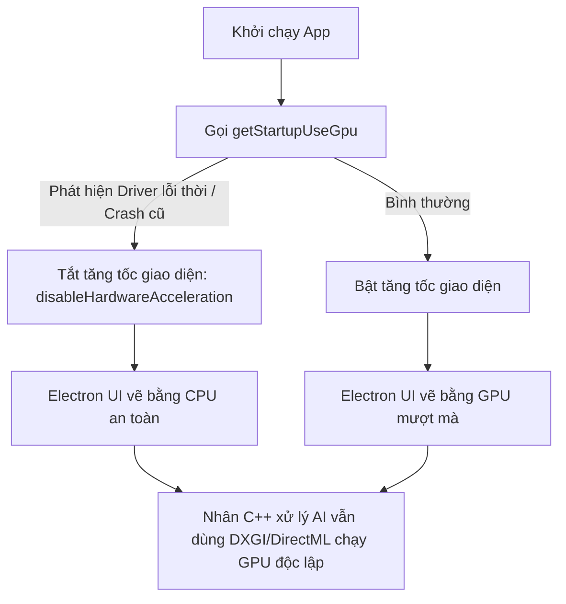

# Phân Tích Kỹ Thuật Tối Ưu Hóa Phần Cứng & Cơ Chế Phòng Vệ GPU Của Cubeo

Hệ thống Cubeo (MagiMir) được tối ưu hóa sâu để chạy mượt mà trên cả các máy trạm studio cấu hình mạnh (sử dụng card đồ họa rời NVIDIA RTX) lẫn các máy tính văn phòng cấu hình tối giản (sử dụng card onboard Intel HD Graphics). 

Dưới đây là tài liệu phân tích kỹ thuật chi tiết về cơ chế quét phần cứng, kiến trúc mô hình kép và giải pháp phòng vệ chống sập màn hình (Black/White screen).

---

## 1. Cơ Chế Nhận Diện Phần Cứng Cục Bộ

Khi khởi động, ứng dụng gọi phương thức native từ lõi C++:
```javascript
var hasGpu = !!this.magpie.gpuInfo();
```

Lõi C++ (`magpie.node`) truy cập trực tiếp vào Windows API thông qua **DXGI (DirectX Graphics Infrastructure)** hoặc **CUDA Driver API** để truy vấn thông tin:
1.  **Nhà sản xuất (Vendor):** Xác định thiết bị thuộc NVIDIA, AMD hay Intel.
2.  **Bộ nhớ đồ họa (VRAM):** Kiểm tra xem dung lượng bộ nhớ VRAM chuyên dụng có đạt mức tối thiểu **4 GB** hay không.
3.  **Driver tương thích:** Kiểm tra sự hiện diện của driver DirectX 12 hoặc CUDA runtime.
*   *Hệ quả:* Nếu VRAM phát hiện được dưới 4GB, giao diện React sẽ hiển thị một cảnh báo nhẹ đề xuất người dùng tắt bớt các ứng dụng đồ họa khác để tránh giật lag khi chạy AI.

---

## 2. Kiến Trúc Mô Hình Kép (Dual-Model GPU/CPU Architecture)

Để đảm bảo hiệu năng tối ưu trên mọi cấu hình, Meitu đóng gói song song **hai định dạng mô hình khác nhau** cho cùng một tính năng xử lý:



### A. Phiên bản chạy GPU (Mô hình `.onnx`):
*   Sử dụng ONNX Runtime làm lõi.
*   Tận dụng nhân Tensor/CUDA (trên card NVIDIA) hoặc thư viện **DirectML** của Microsoft. DirectML cho phép chạy gia tốc AI trên bất kỳ card đồ họa nào hỗ trợ DirectX 12 (bao gồm cả AMD Radeon và Intel Iris Xe onboard) mà không phân biệt hãng sản xuất.

### B. Phiên bản chạy CPU (Mô hình `.mnn` hoặc `_ov.xml`):
*   Nếu máy không có card đồ họa rời, hệ thống chuyển hướng chạy trên CPU.
*   Với chip Intel/AMD tiêu chuẩn, app nạp mô hình dạng OpenVINO (`_ov.xml` / `_ov.bin`) tận dụng các tập lệnh vi xử lý nâng cao (như **AVX2, AVX-512**) để tăng tốc xử lý trực tiếp trên CPU.
*   Với chip ARM hoặc máy cấu hình cực thấp, app nạp mô hình dạng MNN (`.mnn`) sử dụng mã máy Assembly tối giản để chạy nhanh nhất có thể.

---

## 3. Cơ Chế Hạ Cấp Tự Động & Phòng Vệ Đồ Họa (GPU Safeguards)

Khi chạy các mô hình AI trực tiếp trên máy khách, driver đồ họa quá cũ hoặc quá nóng rất dễ dẫn đến sập nhân đồ họa (Device Lost). Cubeo giải quyết triệt để vấn đề này qua 2 cơ chế:

### 3.1. Tự động hạ cấp khi lỗi (Auto-Fallback)
Trong quá trình xử lý ảnh, nếu nhân xử lý GPU gặp lỗi (như tràn VRAM hoặc crash driver giữa chừng), lõi C++ sẽ bắt lỗi (catch exception), tự động giải phóng bộ nhớ GPU và **nóng chuyển đổi (Hot-swap)** tác vụ sang engine chạy CPU (OpenVINO) ngay lập tức. Người dùng vẫn nhận được bức ảnh chỉnh sửa hoàn thiện mà không hề hay biết hệ thống vừa gặp sự cố GPU.

### 3.2. Phòng vệ sập màn hình khi khởi chạy (Startup Checks)
Các ứng dụng Electron sử dụng Chromium để vẽ giao diện. Trên một số driver đồ họa onboard Intel cũ, tính năng tăng tốc phần cứng WebGL của Chromium thường gây ra hiện tượng trắng xóa hoặc đen ngòm màn hình ngay khi mở app. 

Cubeo giải quyết bằng cách **phân tách hoàn toàn** hai tiến trình đồ họa:



1.  **Electron UI Rendering:** Nếu phát hiện mã Driver nằm trong danh sách đen (Blacklist) hoặc lần khởi động trước đó bị sập giữa chừng, Electron sẽ tắt hoàn toàn tính năng tăng tốc đồ họa phần cứng của giao diện (`app.disableHardwareAcceleration()`). UI sẽ được vẽ bằng CPU để đảm bảo an toàn tuyệt đối.
2.  **C++ AI Inference:** Việc tắt GPU của giao diện **không ảnh hưởng** đến nhân xử lý AI. Nhân C++ (`magpie.node`) hoạt động ở tiến trình con (Sub-process) độc lập vẫn tiếp tục gọi Win32 DXGI để tận dụng sức mạnh tính toán của card đồ họa rời cho các mô hình AI.
