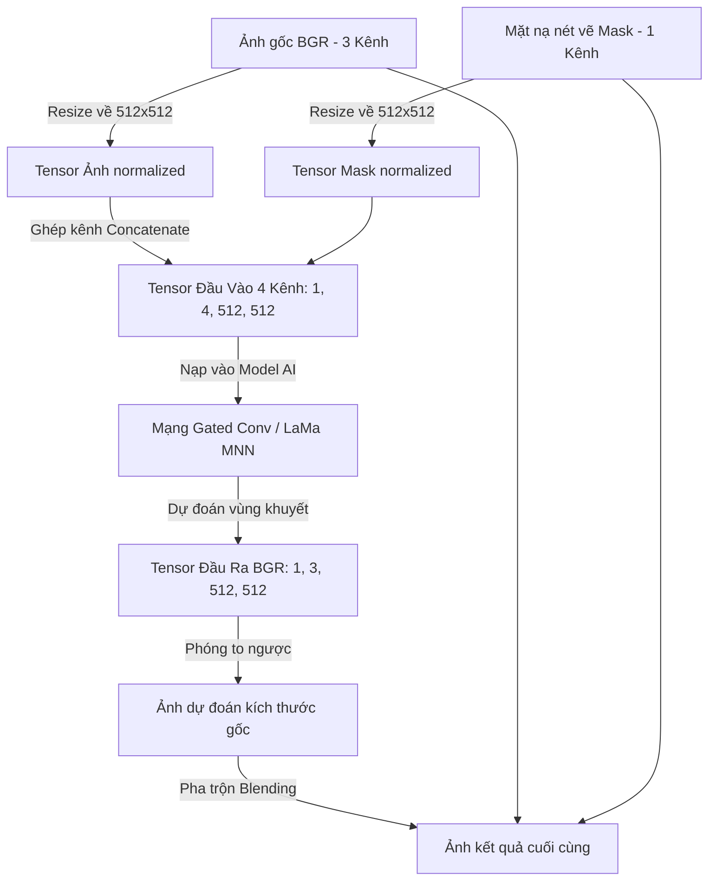

# Phân Tích Thuật Toán & Mô Hình Xóa Vật Thể (Object Inpainting) Của Meitu

Tính năng xóa vật thể, người thừa hay tẩy khuyết điểm (Stain Repair / Clean Passerby) của Meitu (Cubeo, Wink, Evoto) hoạt động cực kỳ mượt mà nhờ sự kết hợp giữa **mô hình mạng tích chập Gated Convolution (hoặc LaMa Inpainting)** chạy cục bộ và cơ chế **pha trộn mặt nạ (Mask Blending)** bảo toàn chi tiết.

Dưới đây là phân tích chi tiết về mô hình, cấu trúc dữ liệu đầu vào/đầu ra và mã nguồn triển khai thực tế.

---

## 1. Phân Tích Các Mô Hình Inpainting Đã Trích Xuất

Từ cơ sở dữ liệu khóa của Cubeo, chúng ta đã xác định được 3 mô hình chuyên biệt cho tác vụ xóa vật thể:

1.  **`CcpJy.onnx` (`clean_passerby` - kích thước ~41.9 MB):**
    *   Mô hình AI chuyên dụng để xóa người đi đường, vật thể lớn hoặc các chi tiết phức tạp trong ảnh phong cảnh/ngoại cảnh.
2.  **`IRv5A601D.onnx` (`inpaintBg` - kích thước ~7.0 MB):**
    *   Mô hình siêu nhẹ chuyên vẽ bù phông nền (Background Inpainting) cho các vùng bị khuyết nhỏ hoặc chỉnh sửa nhanh.
3.  **`IRv5A502B.onnx` (`inpaintClothe` - kích thước ~6.5 MB):**
    *   Mô hình chuyên dụng xóa nếp nhăn, vết bẩn và tái tạo bề mặt vải vóc của trang phục.

### Định dạng thực tế của mô hình:
Mặc dù có phần mở rộng tên tệp là `.onnx`, nhưng khi kiểm tra 16 byte đầu tiên của các tệp này, chúng đều xuất hiện chuỗi signature:
`20 00 00 00 1c 00 24 00 08 00 00 00 0c 00 10 00`

Đây là chữ ký cấu trúc tuần tự hóa **FlatBuffers** của **Alibaba MNN** (Mobile Neural Network). Meitu đóng gói mô hình dưới dạng MNN để chạy mượt mà trên cả CPU và GPU máy khách (thông qua Vulkan/OpenCL/Metal).

---

## 2. Sơ Đồ Thuật Toán Xử Lý (Inpainting Pipeline)

Quá trình xóa vật thể diễn ra theo 4 bước khép kín dưới đây:



---

## 3. Cơ Chế Xử Lý Kênh Đầu Vào (4-Channel Tensor Input)

Điểm mấu chốt để mô hình AI biết cần phải xóa khu vực nào là việc **ghép kênh (Concatenate)** giữa ảnh gốc và mặt nạ cọ vẽ (Mask):

*   **Ảnh gốc (Image):** Có 3 kênh màu B, G, R.
*   **Mặt nạ (Mask):** Có 1 kênh đơn sắc (Grayscale). Giá trị `255` (hoặc `1.0`) biểu thị vùng người dùng bôi cọ muốn xóa; giá trị `0` biểu thị vùng cần giữ nguyên.
*   **Ghép kênh:** Ghép theo chiều dọc kênh (Channel dimension) để tạo thành một tensor duy nhất có **4 kênh màu** dạng `(1, 4, H, W)`.
    $$\text{Input Tensor} = [\text{Channel}_B, \text{Channel}_G, \text{Channel}_R, \text{Channel}_{Mask}]$$

---

## 4. Cơ Chế Pha Trộn Bảo Toàn Pixel Gốc (Mask Blending)

Để đảm bảo các vùng không bị xóa giữ được độ nét 100% gốc (không bị mờ do quá trình nén và giải nén của AI), Meitu áp dụng thuật toán pha trộn ảnh dựa trên công thức toán học:

$$\text{Image}_{\text{final}} = \text{Mask} \times \text{Image}_{\text{predicted}} + (1 - \text{Mask}) \times \text{Image}_{\text{original}}$$

*   Tại vùng cần xóa ($\text{Mask} = 1$): Kết quả lấy 100% từ ảnh dự đoán của AI.
*   Tại vùng giữ nguyên ($\text{Mask} = 0$): Kết quả lấy 100% từ ảnh gốc ban đầu.
*   Tại viền biên mặt nạ ($\text{Mask}$ chạy từ $0 \to 1$): Áp dụng làm mờ Gaussian (Gaussian Blur) trên mặt nạ để viền chuyển tiếp giữa ảnh gốc và ảnh vẽ bù của AI trông mượt mà tự nhiên, không bị lộ vệt cắt.

---

## 5. Mã Nguồn Triển Khai Chi Tiết (Python & OpenCV)

Dưới đây là class wrapper `MeituInpainter` viết bằng Python để mô phỏng hoàn chỉnh quy trình tiền xử lý, nạp mô hình MNN và thực hiện pha trộn blending:

```python
import cv2
import numpy as np
import MNN

class MeituInpainter:
    def __init__(self, model_path):
        """
        Khởi tạo và nạp mô hình xóa vật thể dạng MNN
        """
        self.interpreter = MNN.Interpreter(model_path)
        self.session = self.interpreter.createSession()
        self.input_tensor = self.interpreter.getSessionInput(self.session)
        
        # Đọc hình dạng đầu vào yêu cầu (ví dụ: 1, 4, 512, 512)
        self.input_shape = self.input_tensor.getShape()
        self.height = self.input_shape[2]
        self.width = self.input_shape[3]
        print(f"[+] Loaded MNN Inpaint Model. Required Shape: {self.input_shape}")

    def preprocess(self, img, mask):
        """
        Tiền xử lý ảnh gốc và mặt nạ thành tensor 4 kênh
        """
        # 1. Resize ảnh gốc và mask về kích thước mô hình yêu cầu (ví dụ: 512x512)
        img_resized = cv2.resize(img, (self.width, self.height), interpolation=cv2.INTER_LINEAR)
        mask_resized = cv2.resize(mask, (self.width, self.height), interpolation=cv2.INTER_NEAREST)
        
        # 2. Chuẩn hóa ảnh về khoảng [-1, 1] hoặc [0, 1] tùy mô hình
        img_normalized = img_resized.astype(np.float32) / 127.5 - 1.0  # Chuẩn hóa về [-1, 1]
        
        # 3. Chuẩn hóa mask về [0, 1]
        mask_normalized = (mask_resized.astype(np.float32) > 0).astype(np.float32)
        if len(mask_normalized.shape) == 2:
            mask_normalized = np.expand_dims(mask_normalized, axis=2) # Đảm bảo có chiều kênh màu
            
        # 4. Ghép kênh (Concatenate) dọc theo trục channel -> Kích thước (512, 512, 4)
        input_data = np.concatenate([img_normalized, mask_normalized], axis=2)
        
        # 5. Đổi từ HWC sang CHW -> (4, 512, 512)
        input_data = np.transpose(input_data, (2, 0, 1))
        
        # 6. Thêm chiều batch size -> (1, 4, 512, 512)
        input_data = np.expand_dims(input_data, axis=0)
        
        return input_data

    def postprocess(self, output_data, orig_img, orig_mask):
        """
        Hậu xử lý kết quả dự đoán từ AI và pha trộn mịn (Blending) với ảnh gốc
        """
        # 1. Loại bỏ batch dimension và chuyển vị từ CHW sang HWC -> (512, 512, 3)
        output_hwc = np.squeeze(output_data, axis=0)
        output_hwc = np.transpose(output_hwc, (1, 2, 0))
        
        # 2. Giải chuẩn hóa ngược từ [-1, 1] về [0, 255]
        predicted_img = np.clip((output_hwc + 1.0) * 127.5, 0, 255).astype(np.uint8)
        
        # 3. Phóng to ảnh dự đoán ngược lại kích thước ảnh gốc ban đầu
        orig_h, orig_w, _ = orig_img.shape
        predicted_resized = cv2.resize(predicted_img, (orig_w, orig_h), interpolation=cv2.INTER_CUBIC)
        
        # 4. Tạo mặt nạ viền mờ (Feathered Mask) để tránh lộ biên ghép nối
        # Áp dụng Gaussian Blur lên mask gốc để làm mềm vùng chuyển tiếp
        mask_blur = cv2.GaussianBlur(orig_mask, (15, 15), 0)
        mask_norm = mask_blur.astype(np.float32) / 255.0
        if len(mask_norm.shape) == 2:
            mask_norm = np.expand_dims(mask_norm, axis=2)
            
        # 5. Công thức pha trộn Blending bảo toàn pixel gốc:
        # Final = Mask * Predicted + (1 - Mask) * Original
        final_img = (mask_norm * predicted_resized + (1.0 - mask_norm) * orig_img)
        final_img = np.clip(final_img, 0, 255).astype(np.uint8)
        
        return final_img

    def inpaint(self, image_path, mask_path):
        # Đọc ảnh gốc và mặt nạ nét vẽ từ đĩa
        img = cv2.imread(image_path)  # BGR
        mask = cv2.imread(mask_path, cv2.IMREAD_GRAYSCALE)  # Grayscale (0 hoặc 255)
        
        # Tiền xử lý dữ liệu đầu vào
        input_data = self.preprocess(img, mask)
        
        # Nạp dữ liệu vào Session MNN
        tmp_tensor = MNN.Tensor(self.input_shape, MNN.Halide_Type_Float, 
                                input_data, MNN.Tensor_DimensionType_CArray)
        self.input_tensor.copyFrom(tmp_tensor)
        
        # Chạy suy luận (Inference)
        self.interpreter.runSession(self.session)
        
        # Trích xuất Tensor đầu ra (Output Tensor)
        output_tensor = self.interpreter.getSessionOutput(self.session)
        output_data = output_tensor.getData()  # Lấy mảng dữ liệu thô
        
        # Thực hiện hậu xử lý & Blending
        result_img = self.postprocess(output_data, img, mask)
        return result_img
```
