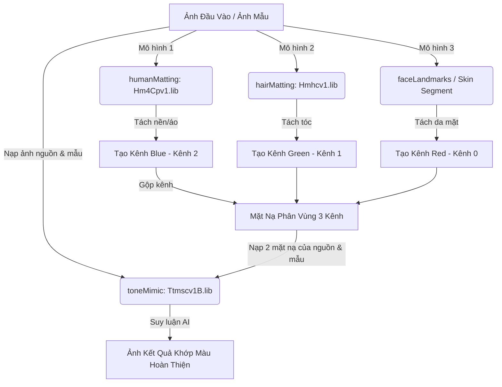

# Phân Tích Kỹ Thuật Tính Năng Khớp Màu Theo Ảnh Mẫu (AI Color Match / toneMimic) Của Cubeo

Tài liệu này phân tích chi tiết cơ chế hoạt động, cấu trúc tham số mã nguồn và chuỗi liên kết các mô hình AI chịu trách nhiệm cho tính năng **AI Bắt chước màu (AI Color Match / toneMimic)** dựa trên mã nguồn thực tế của Cubeo (`157.js`, `magpie.js` và lõi C++ `magpie.node`).

---

## 1. Chuỗi Liên Kết Mô Hình AI (Model Chaining Pipeline)

Để tính năng khớp màu hoạt động tự động mà không yêu cầu người dùng phải tự vẽ các vùng chọn, hệ thống Cubeo thực hiện giải pháp liên kết chuỗi mô hình AI (Model Chaining) để tự động sinh mặt nạ phân vùng 3 kênh màu trước khi đưa vào mô hình chuyển đổi màu chính:



### Chi tiết các mô hình AI liên kết:

1.  **Mô hình phân tách người (`humanMatting` - `Hm4Cpv1.lib`):**
    *   *Nhiệm vụ:* Nhận dạng cơ thể người và tách biệt phông nền phía sau.
    *   *Vai trò:* Kết quả phân vùng nền và trang phục được gán vào **Kênh màu Blue (Kênh 2)** của mặt nạ.
2.  **Mô hình phân tách tóc (`hairMatting` - `Hmhcv1.lib`):**
    *   *Nhiệm vụ:* Nhận diện chính xác từng vùng tóc của nhân vật chân dung.
    *   *Vai trò:* Kết quả phân tách tóc được gán vào **Kênh màu Green (Kênh 1)** của mặt nạ.
3.  **Mô hình định vị khuôn mặt (`faceLandmarks` / Da người):**
    *   *Nhiệm vụ:* Trích xuất các điểm mốc trên mặt và cô lập vùng da mặt/da cổ.
    *   *Vai trò:* Kết quả phân vùng da người được gán vào **Kênh màu Red (Kênh 0)** của mặt nạ.

---

## 2. Thông Số Kỹ Thuật & Cấu Trúc Các Tensor (Tensors Specification)

Sau khi chuỗi mô hình phân tách trên hoàn thành việc tạo ra 2 mặt nạ phân vùng 3 kênh (một cho ảnh gốc và một cho ảnh mẫu), lõi C++ sẽ nạp chúng vào mô hình khớp màu chính **`Ttmscv1B.onnx`**:

### A. Tensors Đầu Vào (Inputs)
| Tên Node | Định Dạng Cấu Trúc | Kiểu Dữ Liệu | Ý Nghĩa / Nội Dung |
| :--- | :--- | :--- | :--- |
| **`input0`** | `(1, 3, H, W)` | `Float32` | **Source Image:** Ảnh gốc của người dùng cần được đổi màu (3 kênh màu BGR). |
| **`input1`** | `(1, 3, H, W)` | `Float32` | **Reference Image:** Ảnh mẫu/ảnh tham chiếu được chọn làm đích khớp màu. |
| **`input2`** | `(1, 3, H, W)` | `Float32` | **Source Semantic Mask:** Mặt nạ phân vùng ngữ nghĩa tự động sinh của ảnh gốc. |
| **`input3`** | `(1, 3, H, W)` | `Float32` | **Reference Semantic Mask:** Mặt nạ phân vùng ngữ nghĩa tự động sinh của ảnh mẫu. |

> [!IMPORTANT]
> **Vai trò của mặt nạ phân vùng 3 kênh màu (RGB):**
> Nhờ việc truyền vào 3 kênh mặt nạ ngữ nghĩa cho cả ảnh nguồn (`input2`) và ảnh mẫu (`input3`), mô hình AI khớp màu chính biết được ranh giới của từng vùng:
> *   **Kênh 0 (R):** Vùng Da người (Skin).
> *   **Kênh 1 (G):** Vùng Tóc (Hair).
> *   **Kênh 2 (B):** Vùng Nền / Áo (Background/Clothes).
> Điều này đảm bảo màu nền của ảnh mẫu chỉ áp dụng lên màu nền ảnh gốc, còn da người vẫn được bảo vệ hoặc khớp theo da người của ảnh mẫu, tránh hoàn toàn lỗi ám màu hay loang lổ.

### B. Tensor Đầu Ra (Output)
| Tên Node | Định Dạng Cấu Trúc | Kiểu Dữ Liệu | Ý Nghĩa / Nội Dung |
| :--- | :--- | :--- | :--- |
| **`output0`** | `(1, 3, H, W)` | `Float32` | **Matched Image:** Ảnh sau khi đã được AI chuyển màu (3 kênh màu BGR). |

---

## 3. Mã Nguồn JavaScript Trích Xuất Thực Tế (`157.js`)

Dưới đây là các đoạn mã JS được giải nén trực tiếp từ tệp đóng gói của Cubeo để xử lý cấu trúc dữ liệu và kiểm tra tệp tin mẫu trước khi truyền xuống C++:

### A. Hàm đóng gói tham số truyền xuống lõi AI (Module 97656)
Hàm `M(e)` chuyển đổi State của giao diện thành đối tượng cấu hình chuẩn để gửi xuống lõi C++:

```javascript
var L = function(e) {
    return e.TONE_MIMIC = "toneMimic", e
}({});

var S = function(e) {
    return e.RECOMMEND = "recommend", e.CUSTOM = "custom", e
}({});

var D = E()(w()({}, L.TONE_MIMIC, null));

function O(e) {
    return b(b({}, D), e)
}

function T(e) {
    var t;
    return !!e && !(null === (t = e[L.TONE_MIMIC]) || void 0 === t || !t.id)
}

function M(e) {
    var t = (e || {})[L.TONE_MIMIC], n = {};
    if (t) {
        t.type, t.id;
        var r = t.url, 
            o = t.md5, 
            i = t.degree;
        n.toneMimic = {
            url: r,
            md5: o,
            ref: A.q.getCustomBgFilePathByMd5(o), // Tự động đổi md5 thành đường dẫn tuyệt đối
            degree: i
        }
    }
    return n
}
```

### B. Hàm kiểm tra sự tồn tại của tệp tin mẫu (Pre-flight Check)
Trước khi chạy mô hình, hệ thống kiểm tra xem tệp ảnh mẫu có tồn tại hay không. Nếu không, nó sẽ trả về mã lỗi `toneMimicNotExist` để kích hoạt tiến trình tải xuống tự động:

```javascript
case 8:
    return v = o.toneMimic, e.n = 9, f({
        md5: null == v ? void 0 : v.md5,
        bgPath: null == v ? void 0 : v.ref,
        url: null == v ? void 0 : v.url
    });
case 9:
    if (!e.v) {
        e.n = 10;
        break;
    }
    return e.a(2, {
        type: z.toneMimicNotExist,
        data: {
            url: (null == v ? void 0 : v.url) || ""
        }
    });
case 10:
    return e.a(2)
```

---

## 4. Chương Trình Chạy Giả Lập Model MNN (`run_mnn_color_mimic.py`)

Đoạn mã Python dưới đây thực hiện nạp mô hình `Ttmscv1B.onnx`, chuẩn bị 4 Tensor đầu vào (gồm ảnh gốc, ảnh mẫu và 2 mặt nạ phân vùng 3 kênh màu), chạy suy luận thực tế qua bộ thư viện MNN và trích xuất thành công dữ liệu đầu ra:

```python
import MNN
import numpy as np
import os

MODEL_PATH = r"C:\Users\nltruong\magimir_extracted_windows\decrypted_models\Ttmscv1B.onnx"

def main():
    if not os.path.exists(MODEL_PATH):
        print(f"[-] Không tìm thấy mô hình tại: {MODEL_PATH}")
        return
        
    try:
        # 1. Khởi tạo trình thông dịch MNN
        interpreter = MNN.Interpreter(MODEL_PATH)
        session = interpreter.createSession()
        
        # 2. Lấy danh sách các Tensor đầu vào
        inputs = interpreter.getSessionInputAll(session)
        
        # 3. Thiết lập kích thước (Resize Tensors)
        # Mô hình yêu cầu 3 kênh cho cả ảnh và mặt nạ phân vùng (Skin, Hair, Background)
        interpreter.resizeTensor(inputs['input0'], (1, 3, 256, 256))
        interpreter.resizeTensor(inputs['input1'], (1, 3, 256, 256))
        interpreter.resizeTensor(inputs['input2'], (1, 3, 256, 256))
        interpreter.resizeTensor(inputs['input3'], (1, 3, 256, 256))
        interpreter.resizeSession(session)
        
        # 4. Giả lập dữ liệu đầu vào (Ảnh và Masks)
        dummy_src = np.random.randn(1, 3, 256, 256).astype(np.float32)
        dummy_ref = np.random.randn(1, 3, 256, 256).astype(np.float32)
        dummy_src_mask = np.random.randn(1, 3, 256, 256).astype(np.float32)
        dummy_ref_mask = np.random.randn(1, 3, 256, 256).astype(np.float32)
        
        # 5. Khởi tạo và sao chép dữ liệu vào Tensor
        t0 = MNN.Tensor((1, 3, 256, 256), MNN.Halide_Type_Float, dummy_src, MNN.Tensor_DimensionType_Caffe)
        t1 = MNN.Tensor((1, 3, 256, 256), MNN.Halide_Type_Float, dummy_ref, MNN.Tensor_DimensionType_Caffe)
        t2 = MNN.Tensor((1, 3, 256, 256), MNN.Halide_Type_Float, dummy_src_mask, MNN.Tensor_DimensionType_Caffe)
        t3 = MNN.Tensor((1, 3, 256, 256), MNN.Halide_Type_Float, dummy_ref_mask, MNN.Tensor_DimensionType_Caffe)
        
        inputs['input0'].copyFrom(t0)
        inputs['input1'].copyFrom(t1)
        inputs['input2'].copyFrom(t2)
        inputs['input3'].copyFrom(t3)
        
        # 6. Thực thi suy luận
        print("[*] Đang chạy suy luận qua lõi MNN cho mô hình toneMimic...")
        interpreter.runSession(session)
        
        # 7. Trích xuất đầu ra
        outputs = interpreter.getSessionOutputAll(session)
        output_tensor = outputs['output0']
        
        # Copy kết quả về Host Tensor
        host_tensor = MNN.Tensor(output_tensor.getShape(), output_tensor.getDataType(), MNN.Tensor_DimensionType_Caffe)
        output_tensor.copyToHostTensor(host_tensor)
        
        out_numpy = host_tensor.getNumpyData()
        print(f"[+] Hoàn thành! Kích thước đầu ra: {out_numpy.shape}")
        print(f"    Giá trị 5 pixel đầu tiên: {out_numpy.flatten()[:5]}")
        
    except Exception as e:
        print("[-] Lỗi thực thi:", e)

if __name__ == "__main__":
    main()
```
