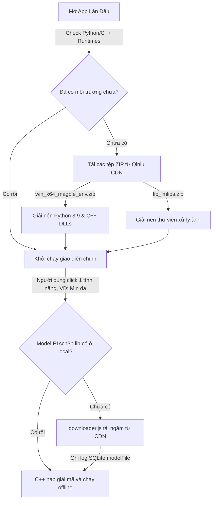
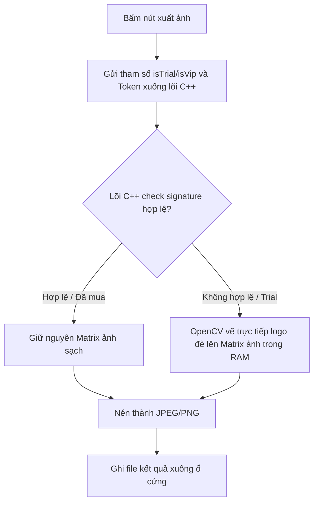

# Phân Tích Kỹ Thuật Cơ Chế Tải Tài Nguyên Động & Bảo Vệ Bản Quyền Hình Ảnh Của Cubeo

Tài liệu này phân tích chi tiết hai hệ thống hạ tầng quan trọng của Cubeo (MagiMir):
1.  **Quy trình tải tài nguyên và mô hình AI theo nhu cầu (Download-on-Demand Pipeline):** Giúp bộ cài đặt ban đầu siêu nhẹ.
2.  **Cơ chế đóng dấu bản quyền Watermark dưới lõi C++ (Anti-Bypass Watermarking):** Chống lại việc bẻ khóa ở lớp giao diện JavaScript.

---

## 1. Cơ Chế Tải Tài Nguyên & Mô Hình AI Theo Nhu Cầu

Để bộ cài đặt ban đầu của Cubeo chỉ nặng khoảng **100 MB** (chỉ chứa nhân Electron và mã nguồn UI cơ bản), nhà phát triển áp dụng thiết kế trình cài đặt phân tách (**Split-Installer Design**). Hơn 2.5 GB tài nguyên chạy ngầm sẽ được tải động về máy khách:

### 1.1. Tải môi trường hệ thống (System Runtimes)
Khi khởi chạy lần đầu tiên, Electron Main kiểm tra sự tồn tại của môi trường thực thi. Nếu thiếu, nó sẽ tải các tệp nén lớn sau về thư mục tạm `AppData\Roaming\MagiMir\temp\downloads\` và giải nén vào thư mục chương trình chính `AppData\Local\Programs\MagiMir\Versions\win_x64_intl_1.9.3\`:
*   `win_x64_magpie_env_1.0.1.zip` (~230 MB): Chứa Python 3.9 nhúng (Embedded) và các runtimes C++.
*   `lib_imlibs_1.0.0.zip` (~100 MB): Chứa các thư viện xử lý ảnh gốc C++.
*   `win_x64_intl_app_resource_1.9.3.zip` (~120 MB): Bản cập nhật tài nguyên đồ họa giao diện và ngôn ngữ dịch thuật.

### 1.2. Tự động tải mô hình AI (Model Downloader)
Khi người dùng chuyển sang một menu tính năng mới (ví dụ: Chỉnh sửa tóc):
1.  React UI truy vấn bảng `modelFile` trong SQLite `base.db` để kiểm tra tệp mô hình tương ứng (`F2sch1b.lib`) đã có trong thư mục `MagiMir/model/` chưa.
2.  Nếu chưa có, ứng dụng kích hoạt mã nguồn `downloader.js` chạy ẩn danh, lấy liên kết tải xuống trực tiếp (`libUrl`) từ cơ sở dữ liệu để tải tệp từ CDN về đĩa cứng.
3.  Sau khi tải xong, hệ thống cập nhật trạng thái vào SQLite để báo cho lõi C++ tiến hành giải mã AES và nạp mô hình vào RAM xử lý offline.
*   *Lợi ích:* Tiết kiệm dung lượng đĩa cứng của người dùng (không tải các mô hình của tính năng mà họ không dùng tới) và hỗ trợ cập nhật nóng (Hot-update) mô hình AI mới mà không cần cài lại app.

---

## 2. Cơ Chế Đóng Dấu Bản Quyền Watermark & Giới Hạn Dùng Thử

Để thương mại hóa dịch vụ, Cubeo áp dụng cơ chế bảo vệ kép nhằm kiểm soát lượt dùng thử và chống bẻ khóa ảnh xuất:

### 2.1. Giới hạn lượt xuất ảnh dùng thử (Trial Quota Clamping)
*   Trạng thái dùng thử được quản lý qua biến `retouchTrialStore.ifUseTrial` ở Renderer.
*   Mỗi khi xuất ảnh, hệ thống gửi yêu cầu POST đến API trực tuyến `/appApi/activity/getTrialDeductInfo` để trừ số lượng lượt xuất ảnh miễn phí trong ngày của thiết bị khách và đồng bộ số lượt còn lại về giao diện.

### 2.2. Đóng dấu Watermark dưới lớp C++ (C++ Layer Watermarking)
Hầu hết các phần mềm chỉnh ảnh thông thường sẽ vẽ dấu mờ bản quyền (Watermark) ở lớp JavaScript bằng HTML5 Canvas. Tuy nhiên, lập trình viên có thể dễ dàng xóa bỏ Watermark này bằng cách thay đổi logic JS (đổi biến `isTrial` thành `false` hoặc bỏ qua dòng lệnh vẽ đè). 

Để ngăn chặn tuyệt đối việc này, Cubeo đẩy toàn bộ logic vẽ Watermark xuống lõi nhị phân C++ (`magpie.node`):

1.  Khi xuất ảnh, Electron Main truyền cấu hình bản quyền xuống hàm native C++ `magpie.convertImageAsync()`.
2.  Nếu chữ ký số xác thực (Token signature) kiểm tra thất bại hoặc biến trạng thái báo là bản dùng thử (`isTrial = true`), lõi C++ sẽ trực tiếp sử dụng **OpenCV** để vẽ đè tệp tin logo PNG watermark lên ma trận điểm ảnh (Image Pixel Matrix Buffer) đang nằm trong bộ nhớ RAM.
3.  Quá trình vẽ logo đè lên pixel được thực hiện xong, lõi C++ mới bắt đầu nén ma trận ảnh thành file JPEG/PNG và lưu xuống đĩa cứng của người dùng.
4.  Do logo bản quyền đã bị "nén chết" trực tiếp vào cấu trúc nhị phân của ảnh ở tầng C++, **không có cách nào bypass hay loại bỏ watermark bằng cách sửa đổi mã nguồn JavaScript**.

### 💡 Giải pháp nghiên cứu bẻ khóa (Bypass Strategy):
Để xuất ảnh không có watermark, lập trình viên buộc phải:
*   Mô phỏng (Spoofing) chính xác chữ ký Token bản quyền hợp lệ khi gọi API C++ từ JavaScript.
*   Hoặc thực hiện dịch ngược (Reverse Engineering) và vá tệp nhị phân `magpie.node` (Patching binary) để vô hiệu hóa hàm kiểm tra điều kiện vẽ đè watermark của OpenCV trong lõi C++.
