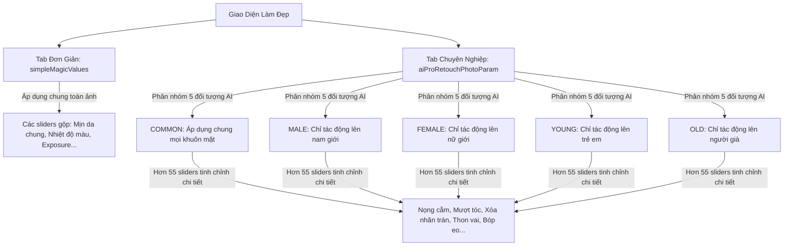

# Phân Tích Kỹ Thuật Chế Độ Làm Đẹp Đơn Giản & Chuyên Nghiệp (Simple vs Pro Retouch) Của Cubeo

Hệ thống làm đẹp chân dung của Cubeo (MagiMir) cung cấp hai chế độ làm việc cho người dùng: **Làm đẹp Đơn giản (Simple)** dành cho chỉnh sửa nhanh toàn cục và **Làm đẹp Chuyên nghiệp (Pro)** dành cho chỉnh sửa tinh tế riêng biệt theo giới tính và độ tuổi.

Dưới đây là tài liệu phân tích kỹ thuật chi tiết về cấu trúc biến cấu hình, phân chia đối tượng nhân chủng học và cơ chế ánh xạ lõi C++.

---

## 1. So Sánh Tổng Quan Kiến Trúc Cấu Hình

Sự khác biệt cốt lõi giữa hai chế độ nằm ở phạm vi tác động và cấu trúc dữ liệu JSON gửi xuống lõi C++:



---

## 2. Chi Tiết Cấu Hình "Làm Đẹp Đơn Giản" (`simpleMagicValues`)

Chế độ đơn giản lưu trữ các tham số trong đối tượng phẳng `simpleMagicValues` và áp dụng đồng loạt lên bức ảnh mà không phân biệt chi tiết từng cá nhân:

```javascript
simpleMagicValues = {
  // Canh chỉnh màu sắc cơ bản
  colorTemperature: 0,      // Nhiệt độ màu (-100 đến 100)
  exposure: 0,              // Độ phơi sáng (-100 đến 100)
  contrast: 0,              // Độ tương phản (-100 đến 100)
  hue: 0,                   // Sắc độ (-100 đến 100)

  // Sliders làm đẹp gộp
  skinSmoothness: 50,       // Mịn da chung (tự động nội suy tỷ lệ skinHighFrequency & skinLowFrequency)
  bodySlimming: 30,         // Thon gọn dáng chung (bóp eo/vai ở mức cơ bản)
  backgroundRemove: false,  // Tách nền nhanh để đổi màu
  clothingSmoothnessDegree: 0 // Làm phẳng quần áo gộp
}
```

---

## 3. Chi Tiết Cấu Hình "Làm Đẹp Chuyên Nghiệp" (`aiProRetouchPhotoParam`)

Điểm vượt trội của Cubeo là chế độ Chuyên nghiệp. Khi người dùng nạp ảnh, mô hình phân loại **`Ga2.onnx` (Gender & Age)** sẽ chạy ngầm để phát hiện và gán thẻ (Tag) giới tính, độ tuổi cho từng khuôn mặt phát hiện được. 

Mã nguồn React UI quản lý các thanh trượt phân bổ vào 5 sub-tab đối tượng độc lập:

```javascript
aiProRetouchPhotoParam = {
  // 1. Áp dụng chung cho tất cả các đối tượng trong ảnh
  common: {
    removeBrokenHairSlide: 20, // Xóa tóc con
    hairSmoothSlide: 30,       // Mượt tóc
    neutralGrayWuGuan: 40      // Đánh khối ngũ quan 3D
  },
  
  // 2. Chỉ áp dụng lên các khuôn mặt được phân loại là NAM GIỚI
  male: {
    skinHighFrequency: 30,     # Giữ lại nhiều van da nam tính
    skinLowFrequency: 20,
    blemishRemovalDegree: 80,  # Xóa mụn sẹo mạnh
    doubleChinDeform: 50,      # Co nọng cằm nam
    luDingDeform: 0            # Nâng sọ đầu
  },
  
  // 3. Chỉ áp dụng lên các khuôn mặt được phân loại là NỮ GIỚI
  female: {
    skinHighFrequency: 60,     # Làm mịn da cao hơn
    skinLowFrequency: 50,
    makeupTheme: "natural",    # Trang điểm nhẹ tự động
    eyeEnlarge: 40,            # Làm to mắt
    chinSlim: 30               # Gọt cằm V-line
  },
  
  // 4. Chỉ áp dụng lên TRẺ EM (AI giới hạn cường độ để giữ nét ngây thơ)
  young: {
    skinHighFrequency: 10,     # Hạn chế mịn da để không bị bết sáp mặt trẻ em
    skinLowFrequency: 10,
    makeupTheme: "none",       # Vô hiệu hóa trang điểm hoàn toàn
    blemishRemovalDegree: 20
  },
  
  // 5. Chỉ áp dụng lên NGƯỜI LỚN TUỔI / NGƯỜI GIÀ
  old: {
    skinHighFrequency: 40,
    skinLowFrequency: 40,
    faLingWenDegree: 60,       # Tập trung giảm nếp nhăn rãnh cười
    yanZhouWenDegree: 50,      # Giảm vết chân chim quanh mắt
    jingWenDegree: 50          # Giảm nhăn cổ
  }
}
```

---

## 4. Nguyên Lý Phối Hợp Xử Lý Trong Lõi C++

Khi xuất ảnh hoặc render Preview:
1.  Lõi C++ (`magpie.node`) gọi mô hình **`Lp.onnx`** để xác định tọa độ các khuôn mặt, và **`Ga2.onnx`** để phân loại nhóm đối tượng từng mặt.
2.  C++ duyệt qua từng khuôn mặt phát hiện được:
    *   *Khuôn mặt ID 1:* Phân loại là `MALE`. Hệ thống sẽ lấy các tham số trong nhóm `common` cộng với nhóm `male` trong cấu hình JSON để áp dụng thuật toán làm mịn da và bóp mặt tương ứng.
    *   *Khuôn mặt ID 2:* Phân loại là `FEMALE`. Hệ thống sẽ lấy các tham số trong nhóm `common` cộng với nhóm `female` để áp dụng mịn da và trang điểm riêng biệt.
3.  Nhờ cơ chế này, trong một bức ảnh cưới chụp đôi nam nữ, cô dâu sẽ được làm mịn da trắng hồng và trang điểm rực rỡ, trong khi chú rể được giữ nguyên vân da nam tính và chỉ xóa bớt mụn sẹo, giúp bức ảnh chân dung đạt tính thẩm mỹ chuyên nghiệp cao nhất.
