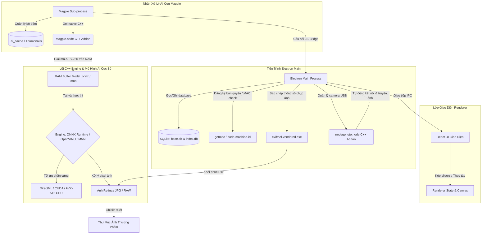

# Phân Tích Kỹ Thuật Hệ Thống Hạ Tầng Phụ Trợ & Kiến Trúc Tổng Thể Của Cubeo

Tài liệu này tổng hợp phân tích về các hệ thống hạ tầng phụ trợ xung quanh lõi AI của Cubeo (MagiMir) bao gồm: cơ chế bảo tồn siêu dữ liệu ảnh (Exif Preservation), hệ thống định danh thiết bị sâu (Deep Fingerprinting), và sơ đồ kiến trúc tổng thể của toàn bộ phần mềm.

---

## 1. Cơ Chế Bảo Tồn Siêu Dữ Liệu Ảnh (Exif Metadata Preservation)

Khi các bức ảnh chân dung hoặc phong cảnh đi qua mạng nơ-ron sâu (AI Models) để retouch và đổi tông màu, định dạng ảnh kết quả xuất ra ở buffer sẽ bị mất sạch toàn bộ siêu dữ liệu chụp ảnh gốc (ngày chụp, hãng máy ảnh, ống kính, khẩu độ, ISO, thông tin bản quyền tác giả).

Để giải quyết vấn đề này, Cubeo tích hợp gói thư viện **`exiftool-vendored`** (phiên bản `12.84.0` đi kèm tệp nhị phân `exiftool-vendored.exe`):

1.  **Ghi nhận dữ liệu gốc:** Trước khi tiến hành nạp ảnh vào lõi C++ để xuất hình, tiến trình Magpie sử dụng `exiftool` đọc và trích xuất toàn bộ header siêu dữ liệu Exif/IPTC/XMP từ tệp ảnh RAW hoặc ảnh JPG gốc ban đầu.
2.  **Khôi phục dữ liệu sau xuất:** Sau khi lõi C++ xuất ra tệp ảnh retouch sạch sẽ, ứng dụng tự động chạy lệnh `exiftool` chạy ẩn để sao chép nguyên trạng (clone) toàn bộ header Exif gốc đè vào tệp tin xuất này.
*   *Ý nghĩa:* Giúp các nhiếp ảnh gia chuyên nghiệp bảo lưu nguyên vẹn thông số chụp và bản quyền tác giả khi nhập ảnh vào Lightroom hay Photoshop sau đó.

---

## 2. Hệ Thống Định Danh Thiết Bị Sâu (Deep Device Fingerprinting)

Để bảo vệ bản quyền phần mềm và khóa giấy phép thiết bị (License Key Binding) một cách bảo mật nhất, chống lại việc làm giả địa chỉ MAC (MAC spoofing), Cubeo kết hợp đồng thời 3 thư viện Node.js:

*   **`getmac`:** Quét địa chỉ MAC của card mạng.
*   **`systeminformation`:** Gọi API phần cứng mức thấp để trích xuất **UUID của bo mạch chủ (Motherboard UUID / Serial Number)** từ BIOS.
*   **`node-machine-id`:** Trích xuất khóa đăng ký Windows độc nhất vô nhị (**Windows Registry GUID**) tại đường dẫn:
    `HKEY_LOCAL_MACHINE\SOFTWARE\Microsoft\Cryptography\MachineGuid`

Hệ thống ghép nối chuỗi ký tự của 3 thành phần này và chạy băm MD5/SHA256 để tạo thành một **mã vân tay phần cứng duy nhất (Unique Device Fingerprint)** cho từng máy tính khách hàng, gửi lên server xác thực bản quyền.

---

## 3. Báo Cáo Sự Cố Tự Động (Crash Reporting)

Ứng dụng tích hợp dịch vụ **Sentry** dành cho Electron (`@sentry/electron`):
*   Khi có bất kỳ sự cố crash đột ngột nào xảy ra ở cả tiến trình giao diện JavaScript (Renderer Process), tiến trình nền chính (Main Process), hoặc lỗi bộ nhớ phân vùng của lõi C++ (`magpie.node`), Sentry sẽ tự động ghi lại Stack Trace và gửi âm thầm báo cáo lỗi về máy chủ log của Meitu để phục vụ kiểm thử và nâng cấp phần mềm.

---

## 4. Sơ Đồ Kiến Trúc Hệ Thống Tổng Thể Của Cubeo

Dưới đây là sơ đồ tổng thể thể hiện mối tương quan phối hợp giữa tất cả các thành phần trong phần mềm Cubeo mà chúng ta đã giải mã thành công:

