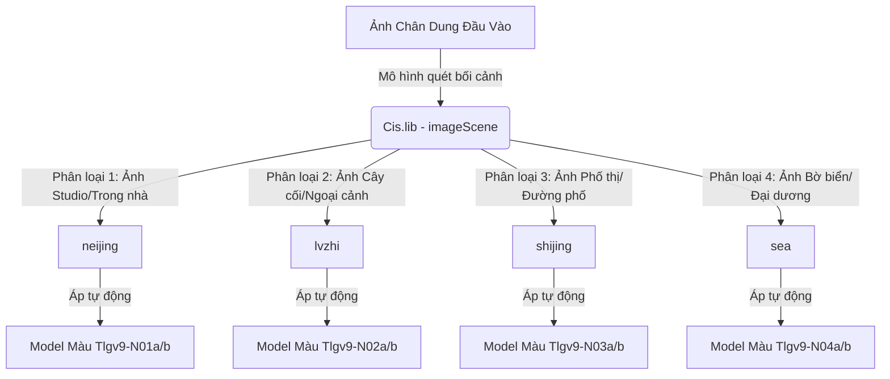

# Phân Tích Kỹ Thuật Siêu Phân Giải Phóng To & Tự Động Nhận Diện Bối Cảnh Của Cubeo

Tính năng siêu phân giải (Super Resolution) và tự động nhận diện bối cảnh ảnh (Auto-Scene Preset Detection) của Cubeo (MagiMir) là các công cụ trợ lực giúp nâng cấp chất lượng ảnh và tự động hóa quy trình hậu kỳ chân dung. Các tính năng này chạy hoàn toàn cục bộ (**Offline 100%**).

Dưới đây là tài liệu phân tích kỹ thuật chi tiết về cấu trúc mô hình, khóa giải mã và sơ đồ liên kết thuật toán.

---

## 1. Siêu Phân Giải Phóng To Ảnh (AI Image Super Resolution)

Tính năng phóng to ảnh thông minh (Upscaling) giúp tăng độ phân giải của bức ảnh (ví dụ từ HD lên 4K) mà không làm vỡ hình bằng cách dự đoán và tái tạo các chi tiết pixel bị thiếu ở đường biên cạnh:

*   **Mô hình 1 (Tone SR):** `Tsrcv4.lib` (Giải mã ra `Tsrcv4.onnx` ~15.1 MB)
    *   *Khóa giải mã AES:* `TrOfrS-PF1wDBg3W_oNg6hO6cKlfUsv-_RtL8Z2Q3zY=`
    *   *Định danh trong code:* `toneSR`
*   **Mô hình 2 (Tone SR 2):** `Tsrcv5s.lib` (Giải mã ra `Tsrcv5s.onnx` ~18.4 MB)
    *   *Khóa giải mã AES:* `bKzFPNbDzFyW4dCbGA-LhZWFYsd_w_3VBfpEhlPrjCJ=`
    *   *Định danh trong code:* `toneSR2`
*   *Nguyên lý hoạt động:* Mô hình sử dụng mạng học sâu tích chập (CNN) học cách ánh xạ từ các khối pixel độ phân giải thấp sang độ phân giải cao, tập trung bù đắp độ sắc nét cho kết cấu da, sợi tóc và các đường biên vật lý, tránh hiện tượng nhòe vỡ ảnh như khi nội suy Bicubic thông thường.

---

## 2. Nhận Diện Bối Cảnh Tự Động Áp Preset Màu (AI Scene Detection)

Để hỗ trợ người dùng chỉnh sửa ảnh hàng loạt nhanh chóng, Cubeo tích hợp một mô hình AI quét nhận dạng bối cảnh để tự động đề xuất và áp dụng preset màu phù hợp:

*   **Mô hình nhận diện bối cảnh:** `Cis.lib` (Giải mã ra `Cis.onnx` ~4.8 MB)
    *   *Khóa giải mã AES:* `dEcV5mzRXCV-ajeajbJmDGqega7MQpJu-730R1EkUDO=`
    *   *Định danh trong code:* `imageScene`
*   **Cơ chế hoạt động:**
    1.  Mô hình `Cis.onnx` phân tích đặc trưng màu sắc và không gian của ảnh để phân loại thành 4 nhóm bối cảnh chính: Trong nhà/Studio (`neijing`), Cây cối/Thiên nhiên (`lvzhi`), Đường phố/Đô thị (`shijing`), và Biển/Đại dương (`sea`).
    2.  Sau khi phân loại xong, lõi C++ tự động gọi mô hình màu `StyleNormV9` tương ứng (Ví dụ: bối cảnh biển `sea` sẽ áp dụng mô hình màu mã hiệu `Tlgv9-N04a` và `Tlgv9-N04b`) để tự động chuyển tông màu ảnh về sắc thái đẹp nhất mà không cần người dùng chọn thủ công.

---

## 3. Hệ Thống Định Vị Khung Xương (Body Pose Detection)

Bên cạnh mô hình nhận diện khuôn mặt `Lp.onnx`, Cubeo sử dụng mô hình định vị khung xương để thực hiện nắn dáng cơ thể (eo, đùi, vai):

*   **Mô hình định vị khung xương:** `Bp.lib` (Giải mã ra `Bp.onnx` ~15.2 MB)
    *   *Khóa giải mã AES:* `NbqFITsPaXOHHgrLF6N-1nQiKXSX69ZUrOfrZCmVyog=`
    *   *Định danh trong code:* `body_pose`
*   *Vai trò:* Nhận diện vị trí bả vai, xương sườn, hông, đầu gối và cổ tay. Tọa độ các khớp xương này làm mốc neo cho các thuật toán nắn bóp dáng (thanh trượt bóp eo, thon vai, kéo dài chân), giúp cơ thể co bóp tự nhiên mà không làm méo các đường thẳng hậu cảnh xung quanh nhân vật.
