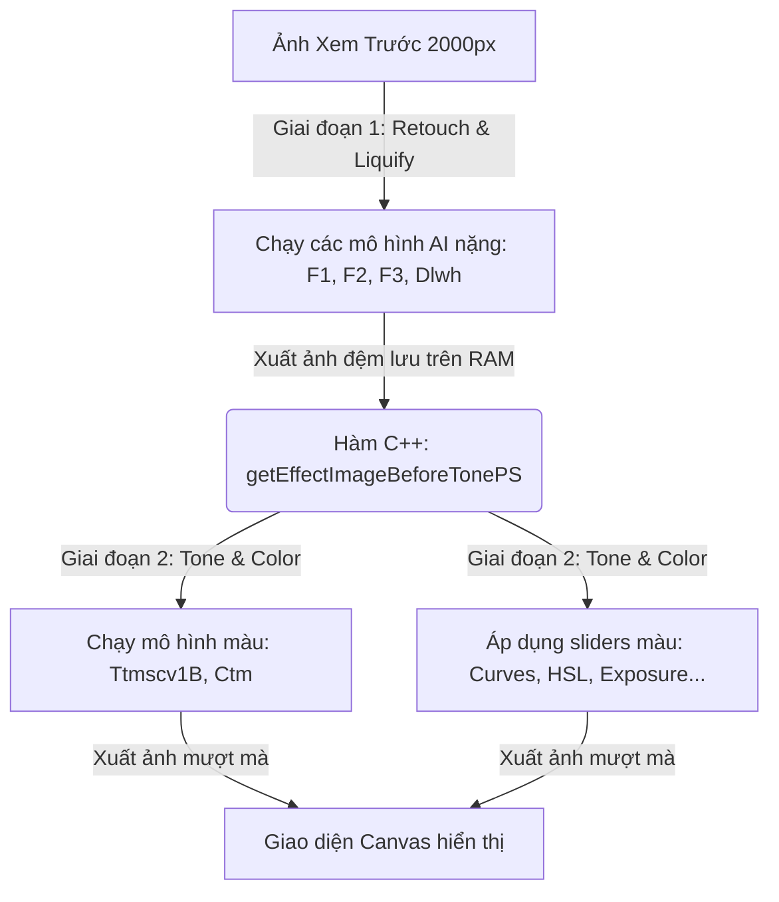
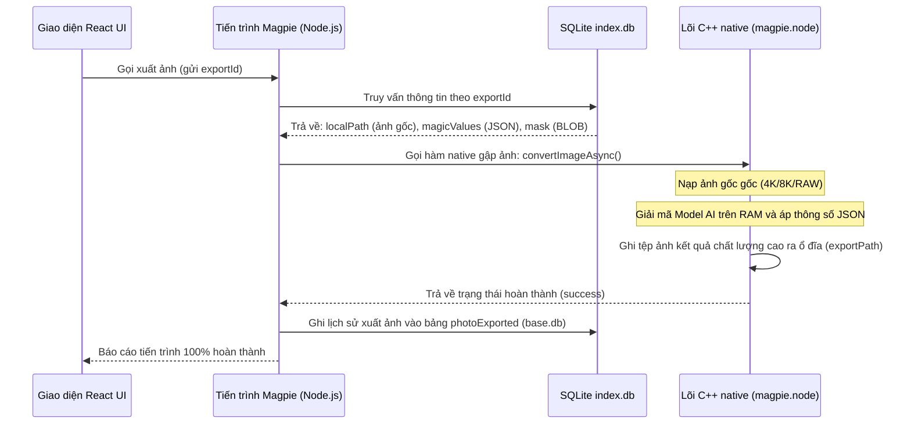

# Phân Tích Kỹ Thuật Hệ Thống Workspace, Cache & Quy Trình Xuất Ảnh Của Cubeo

Hệ thống quản lý không gian làm việc (Workspace), lưu trữ bộ nhớ đệm (Cache) và xuất tệp tin (Export Pipeline) của Cubeo được tối ưu hóa sâu để có thể xử lý đồng thời hàng nghìn ảnh RAW dung lượng lớn mà không gây tràn bộ nhớ RAM hay treo ứng dụng.

Dưới đây là tài liệu phân tích kỹ thuật chi tiết về cơ chế lưu trữ SQLite, quản lý `.ai_cache` và luồng chạy bất đồng bộ khi xuất ảnh.

---

## 1. Cơ Chế Lưu Trữ Tham Số Chỉnh Sửa & Mặt Nạ Vẽ Tay

Toàn bộ lịch sử chỉnh sửa và cấu hình hình ảnh được Cubeo ghi nhận cục bộ bằng cơ sở dữ liệu SQLite 3 tại thư mục:
`C:\Users\<Username>\AppData\Roaming\MagiMir\database\`

### A. Cách lưu các giá trị thanh trượt (magicValues):
*   *Vị trí lưu:* Bảng `exportImg` trong cơ sở dữ liệu `index.db`.
*   *Cơ chế:* Toàn bộ các cấu hình này được đóng gói thành một chuỗi **JSON String** duy nhất và lưu vào cột **`magicValues`**. Việc này giúp ứng dụng dễ dàng mở rộng thêm các thanh trượt mới ở các phiên bản sau mà không cần thay đổi cấu trúc bảng database.

### B. Cách lưu mặt nạ vẽ tay bảo vệ vùng chọn (protectParam):
*   *Vị trí lưu:* Bảng `protectParam` trong cơ sở dữ liệu `index.db`.
*   *Cơ chế:* Hình ảnh mặt nạ nhị phân (đen/trắng) vẽ tay được mã hóa nén và lưu trực tiếp dưới dạng dữ liệu nhị phân **BLOB** (Binary Large Object) tại cột **`mask`** của database.

---

## 2. Chiến Lược Quản Lý Bộ Nhớ Đệm Khi Mở 1000+ Ảnh

Để tránh việc nạp đồng thời hàng chục Gigabyte ảnh gốc làm sập hệ thống (Out Of Memory Crash), Cubeo áp dụng cơ chế xử lý cache hai cấp tại đường dẫn:
`C:\Users\<Username>\AppData\Roaming\MagiMir\.ai_cache\`

### 2.1. Cấp 1: Ảnh thu nhỏ dải phim (Filmstrip Thumbnails - Lazy Loading)
*   Cubeo chạy ngầm để sinh ra các tệp ảnh thumbnail cực nhẹ (~vài chục KB) lưu vào thư mục `.ai_cache`.
*   Giao diện UI chỉ nạp ảnh thu nhỏ lên RAM khi người dùng cuộn danh sách màn hình đến đúng vị trí ảnh đó (**Lazy Loading**).

### 2.2. Cấp 2: Ảnh xem trước trung tâm (Workspace Canvas - Downsampling)
*   Khi người dùng click chọn 1 ảnh để chỉnh sửa, lõi C++ của phần mềm không bao giờ nạp ảnh dung lượng gốc lên bộ nhớ xử lý trực tiếp.
*   Nó sẽ tạo ra một ảnh preview đã được thu nhỏ kích thước tối đa là **2000 pixels** (`maxSize: 2000` được định nghĩa cứng trong lõi C++).
*   Mọi thao tác kéo thanh trượt chỉnh da, nắn mặt, bóp vai đều được thực thi và hiển thị tức thời (Real-time) trên ảnh preview 2000px này.

---

## 3. Cơ Chế Bộ Nhớ Đệm 2 Giai Đoạn (Dual-Stage Caching Pipeline)

Để đảm bảo các thanh trượt màu sắc phản hồi tức thời (~vài mili-giây) mà không cần phải tính toán lại toàn bộ các mô hình học sâu (Deep Learning) nặng nề từ đầu, Cubeo chia quy trình xử lý ảnh ra làm 2 giai đoạn độc lập:



### 3.1. Giai đoạn 1: Làm đẹp & Nắn dáng (Retouch & Liquify)
*   *Các chức năng:* Mịn da (`skinSmoothness`), xóa mụn sẹo (`blemishRemoval`), bóp mặt (`faceLiquify`), nọng cằm (`doubleChinDeform`), bóp người (`bodySlimming`).
*   *Đặc điểm:* Khối lượng tính toán cực kỳ lớn do phải suy luận qua nhiều mô hình CNN sâu và tính toán lưới biến dạng Warp.
*   *Giải pháp tối ưu:* **Chỉ chạy duy nhất 1 lần** khi người dùng vừa mở ảnh hoặc khi thay đổi các thanh trượt tương ứng của nhóm này. Ảnh kết quả sau khi chạy xong giai đoạn 1 sẽ được lưu tạm thời trên bộ nhớ RAM thông qua hàm native: `getEffectImageBeforeTonePS()`.

### 3.2. Giai đoạn 2: Khớp màu & Cân chỉnh màu (Tone & Color)
*   *Các chức năng:* Khớp màu ảnh mẫu (`toneMimic`), Cân bằng trắng AI, Exposure, Contrast, Shadows, Highlights, HSL, Tone Curves.
*   *Đặc điểm:* Khối lượng tính toán nhẹ (chỉ nhân ma trận màu sắc và thay đổi hệ số màu pixel).
*   *Giải pháp tối ưu:* Khi người dùng kéo thanh trượt màu hoặc đổi ảnh mẫu khớp màu, lõi C++ **bỏ qua hoàn toàn Giai đoạn 1** (không chạy lại mịn da, không nắn lại cằm). Nó đọc trực tiếp ảnh đệm đang lưu trên RAM từ hàm `getEffectImageBeforeTonePS()`, áp ma trận màu mới lên và xuất ra màn hình.
*   *Kết quả:* Thanh trượt HSL và Curves phản hồi cực nhạy ở thời gian thực mà không tiêu tốn tài nguyên GPU/CPU để tải lại các mô hình AI lớn.

---

## 4. Quy Trình Xuất Ảnh Chất Lượng Gốc (High-Res Export Pipeline)

Khi người dùng nhấn nút **"Xuất ảnh" (Export)** để lưu ảnh thương phẩm cuối cùng, quy trình xuất ảnh chất lượng gốc bất đồng bộ sẽ được thực thi qua các bước sau:



### Chi tiết hàm native gọi xuống C++ để xuất ảnh:
```javascript
magpie.convertImageAsync(
    sourcePath,      // Đường dẫn tuyệt đối đến tệp ảnh gốc/RAW ban đầu
    destinationPath, // Đường dẫn xuất ảnh đích
    targetSize,      // Kích thước xuất mong muốn
    quality,         // Chất lượng nén ảnh (ví dụ: 95% hoặc 100% JPEG)
    magicValuesJson, // Chuỗi JSON chứa toàn bộ thông số sliders chỉnh sửa
    maskBlob         // Mặt nạ bảo vệ vùng chọn vẽ tay
);
```

Nhờ quy trình tách biệt này, việc chỉnh sửa (Retouch) diễn ra rất nhanh trên ảnh Preview thu nhỏ, còn tài nguyên tính toán nặng của AI chỉ thực sự được nạp đầy đủ để chạy trên ảnh gốc độ phân giải cao tại thời điểm người dùng xuất ảnh.
