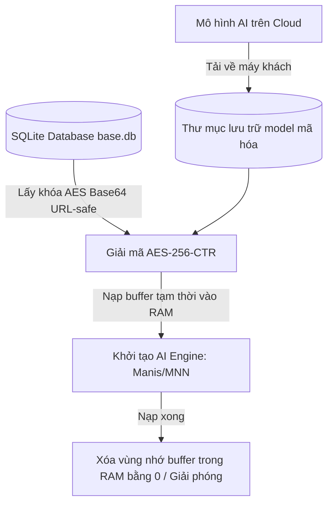

# Phân Tích Cơ Chế Mã Hóa, Bảng Tham Số & Giả Lập Chạy Model AI Của Cubeo (MagiMir)

Tài liệu này phân tích chi tiết cách thức phần mềm **Cubeo** (tên nội bộ/phát triển: **MagiMir**) mã hóa các mô hình học máy (AI Models), cung cấp bảng tra cứu toàn bộ các khóa điều khiển thanh trượt (sliders) và giải pháp chạy giả lập mô hình xử lý ảnh offline bằng Python.

---

## 1. Tổng Quan Kiến Trúc Bảo Mật Model

Các ứng dụng trong hệ sinh thái Meitu (bao gồm Cubeo, Wink, Evoto) sử dụng chung một triết lý bảo mật cho tài nguyên AI:



### Cơ chế phân chia trạng thái mã hóa:
1.  **Các tệp cấu trúc mạng (Model Graph/Topology - `.json`, `.manisa`):** Bị mã hóa chặt chẽ bằng thuật toán mật mã học đối xứng để bảo vệ bản quyền thiết kế mạng neural.
2.  **Các tệp trọng số AI (Weights - `.bin`, `.mnn`):** Thường được lưu ở dạng nhị phân thô (**RAW**) hoặc mã hóa đơn giản để tránh tiêu tốn tài nguyên CPU giải mã khi khởi động ứng dụng, giúp đẩy trực tiếp trọng số lên GPU/NPU qua DirectML hoặc OpenVINO.

---

## 2. Chi Tiết Thuật Toán Mã Hóa

Hệ thống sử dụng thuật toán mã hóa đối xứng tiêu chuẩn công nghiệp:
*   **Thuật toán chính:** **AES-256-CTR** (Advanced Encryption Standard trong chế độ Counter).
*   **Tham số khóa (Key):** Khóa dài 32 bytes (256-bit), được mã hóa dưới dạng **URL-safe Base64** (sử dụng ký tự `-` thay cho `+` và `_` thay cho `/`).
*   **Vector khởi tạo (Nonce/IV):** Sử dụng một chuỗi tĩnh gồm **16 byte 0** (`\x00\x00...\x00`). 

---

## 3. Cơ Chế Quản Lý Khóa Cục Bộ (Key Management)

Khi phần mềm tải một model AI mới từ máy chủ, nó ghi nhận khóa giải mã tương ứng vào một cơ sở dữ liệu SQLite cục bộ không mật khẩu:
*   **Đường dẫn Database:** `C:\Users\<Username>\AppData\Roaming\MagiMir\database\base.db`
*   **Bảng dữ liệu khóa:** `modelFile`
    *   `modelId`: ID liên kết với thông tin mô hình trong bảng `model`.
    *   `key`: Khóa giải mã dạng Base64 URL-safe.
    *   `fileName`: Tên tệp tin đã mã hóa được lưu trên đĩa cứng (thư mục `AppData\Roaming\MagiMir\model`).

---

## 4. Bảng Tham Số Điều Khiển Thanh Trượt (Sliders Parameters)

Khi viết phần mềm clone hoặc giả lập chạy mô hình của Cubeo, bạn cần truyền đúng các khóa tham số (Parameter Keys) được định nghĩa trong file cấu hình dự án `effect.json` của Cubeo để cấu hình các tác vụ xử lý ảnh:

### A. Làm Đẹp & Retouch Khuôn Mặt (`param_vec_int`)
*(Mỗi thông số dưới đây là một mảng 5 phần tử đại diện cho tối đa 5 khuôn mặt được nhận dạng)*

| Tên Khóa Tham Số | Ý Nghĩa Chức Năng |
| :--- | :--- |
| `SmoothFaceSkinAlpha` | Độ mịn da toàn phần |
| `Texture` | Giữ lại cấu trúc hạt da tự nhiên |
| `ShinyCleanAlpha` | Khử bóng dầu trên mặt |
| `SkinWhitening` | Làm trắng da |
| `SkinBrightening` | Làm sáng da |
| `SkinColorTemperature` | Nhiệt độ màu da (ấm/lạnh) |
| `AISkinColorUniformityFace` | Đồng đều màu da mặt bằng AI |
| `WrinkleForeheadRemovalAlpha`| Xóa nếp nhăn trán |
| `WrinkleCheekRemovalAlpha` | Xóa nếp nhăn vùng má |
| `WrinkleNasolabialRemovalAlpha`| Xóa nếp nhăn rãnh cười (râu rồng) |
| `WrinkleNeckRemovalAlpha` | Xóa nếp nhăn vùng cổ |
| `EyeBagRemoval` / `RemovePouch` | Xóa bọng mắt và quầng thâm mắt |
| `FacialSlim` | Thon gọn khuôn mặt |
| `DoubleChin` | Xóa nọng cằm |
| `ToothWhitening` | Làm trắng răng |
| `ToothRepair` | Sửa cấu trúc răng khấp khểnh, răng thưa |
| `BrightenLeftEye` / `RightEye` | Làm sáng mắt trái / phải |
| `FaceSR` / `FaceRestoreAlpha` | Siêu độ phân giải (Làm nét mặt bị mờ) |

### B. Nắn Chỉnh Dáng Người (`param_vec_int` - Body Shaping)
| Tên Khóa Tham Số | Ý Nghĩa Chức Năng |
| :--- | :--- |
| `BodyShapeSlim` | Thon gọn toàn thân |
| `BodyShapeSlimLeg` | Làm thon chân |
| `BodyShapeSlimWaist` | Bóp thon eo |
| `BodyShapeChestEnlarge` | Nâng ngực |
| `BodyShapeSlimHip` | Bóp/Nâng hông |
| `BodyShapeThinShoulders` | Làm thon vai |
| `BodyShapeSwanNeckLeft` / `Right`| Chỉnh cổ thiên nga (trái / phải) |
| `AxillaryFatRemoval` | Xóa mỡ thừa vùng nách cô dâu |

### C. Bộ Lọc & Chỉnh Màu Toàn Cục (`param_int` - Global Adjustments)
| Tên Khóa Tham Số | Ý Nghĩa Chức Năng |
| :--- | :--- |
| `Temperature` | Nhiệt độ màu (K) |
| `Hue` | Sắc thái màu (Tint) |
| `Exposure` | Độ phơi sáng |
| `Constrast` | Độ tương phản |
| `Highlight` | Vùng sáng (Highlights) |
| `Shadow` | Vùng tối (Shadows) |
| `Saturability` | Độ bão hòa màu |
| `Definition` | Độ rõ nét (Clarity) |
| `Sharpness` | Độ sắc nét (Sharpen) |

### D. Trang Phục & Phông Nền
| Tên Khóa Tham Số | Ý Nghĩa Chức Năng |
| :--- | :--- |
| `ClothWrinkleRemoval` | Xóa nhăn quần áo |
| `ClothSmooth` | Làm phẳng và mượt quần áo |
| `IDPhotoBgType` | Loại nền ảnh thẻ (`IDPhotoBackColor`: Mã màu Hex) |
| `SkyAlpha` | Độ đậm nhạt của phông nền trời ghép |
| `SkyBlur` | Độ mờ của bầu trời phía sau |

---

## 5. Chương Trình Giả Lập Chạy Model AI Cục Bộ (Inference Pipeline)

Dưới đây là mã nguồn Python hoàn chỉnh giúp tải một mô hình đã giải mã của Cubeo (ở đây là model chỉnh nhiệt độ màu `Tcv5s00_onnx.onnx`), tự động thực hiện tiền xử lý ảnh (bao gồm **đệm kênh màu từ 3 lên 16**), chạy suy luận bằng ONNX Runtime và lưu kết quả.

### Mã nguồn Python chạy giả lập (`run_cubeo_inference_pipeline.py`):
```python
import os
import cv2
import numpy as np
import onnxruntime as ort

# Đường dẫn tệp tin cấu hình
INPUT_IMAGE_PATH = r"C:\Users\nltruong\input_face.jpg"
MODEL_PATH = r"C:\Users\nltruong\magimir_extracted_windows\decrypted_models\Tcv5s00_onnx.onnx"
OUTPUT_IMAGE_PATH = r"C:\Users\nltruong\scratch\output_tone.jpg"

def preprocess_image(image_path, target_size=(256, 256), target_channels=16):
    """
    Tiền xử lý ảnh gốc: Đọc, Resize, Chuẩn hóa và Đệm thêm kênh màu lên 16 channels
    """
    if not os.path.exists(image_path):
        raise FileNotFoundError(f"Không tìm thấy ảnh tại: {image_path}")
        
    # 1. Đọc ảnh dạng BGR
    img = cv2.imread(image_path)
    h, w, c = img.shape
    print(f"[*] Kích thước ảnh gốc: {w}x{h} (channels: {c})")
    
    # 2. Resize ảnh về kích thước mô hình yêu cầu (256x256)
    img_resized = cv2.resize(img, target_size, interpolation=cv2.INTER_LINEAR)
    
    # 3. Chuẩn hóa pixel về [0.0, 1.0]
    img_normalized = img_resized.astype(np.float32) / 255.0
    
    # 4. Đưa định dạng về CHW (Channels, Height, Width) -> (3, 256, 256)
    img_chw = np.transpose(img_normalized, (2, 0, 1))
    
    # 5. Đệm (Pad) thêm 13 kênh màu tĩnh bằng 0 để tạo thành tensor 16 kênh đầu vào
    padding_channels = target_channels - c
    padding = np.zeros((padding_channels, target_size[0], target_size[1]), dtype=np.float32)
    
    # Kết hợp: BGR (3) + Padding (13) -> 16 channels
    input_tensor = np.concatenate([img_chw, padding], axis=0)
    
    # 6. Thêm chiều batch_size (1, 16, 256, 256)
    input_tensor = np.expand_dims(input_tensor, axis=0)
    
    return input_tensor, img.shape

def postprocess_output(output_tensor, original_shape):
    """
    Hậu xử lý đầu ra: Loại bỏ batch, đưa về HWC, nhân 255 và phóng to về ảnh gốc
    """
    # 1. Loại bỏ batch_size -> (3, 256, 256)
    output_chw = np.squeeze(output_tensor, axis=0)
    
    # 2. Đưa về HWC -> (256, 256, 3)
    output_hwc = np.transpose(output_chw, (1, 2, 0))
    
    # 3. Đưa giá trị về [0, 255] và chuyển kiểu dữ liệu uint8
    output_img = np.clip(output_hwc * 255.0, 0, 255).astype(np.uint8)
    
    # 4. Resize khôi phục lại kích thước ảnh ban đầu
    orig_h, orig_w, _ = original_shape
    output_resized = cv2.resize(output_img, (orig_w, orig_h), interpolation=cv2.INTER_CUBIC)
    
    return output_resized

def main():
    if not os.path.exists(MODEL_PATH):
        print(f"[-] Lỗi: Không tìm thấy model tại {MODEL_PATH}")
        return
        
    print("="*60)
    print(f"[*] Đang nạp mô hình: {os.path.basename(MODEL_PATH)}")
    session = ort.InferenceSession(MODEL_PATH)
    print("[+] Mô hình nạp thành công.")
    
    # Tiền xử lý ảnh
    print("\n[*] Đang thực hiện tiền xử lý ảnh...")
    input_tensor, orig_shape = preprocess_image(INPUT_IMAGE_PATH)
    
    # Thực thi suy luận (Inference)
    input_name = session.get_inputs()[0].name
    output_name = session.get_outputs()[0].name
    print(f"\n[*] Đang chạy suy luận qua ONNX Runtime...")
    
    outputs = session.run([output_name], {input_name: input_tensor})
    output_tensor = outputs[0]
    
    # Hậu xử lý ảnh
    print("\n[*] Đang thực hiện hậu xử lý...")
    final_image = postprocess_output(output_tensor, orig_shape)
    
    # Lưu ảnh kết quả
    os.makedirs(os.path.dirname(OUTPUT_IMAGE_PATH), exist_ok=True)
    cv2.imwrite(OUTPUT_IMAGE_PATH, final_image)
    print(f"[+] Lưu ảnh kết quả thành công tại: {OUTPUT_IMAGE_PATH}")
    print("="*60)

if __name__ == "__main__":
    main()
```
